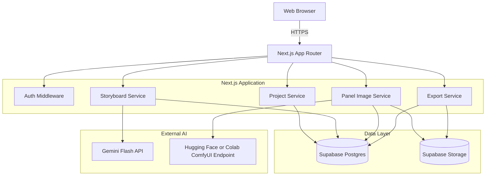
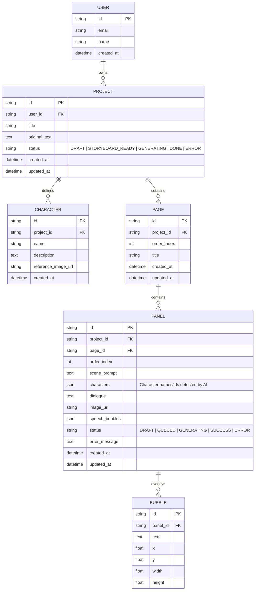
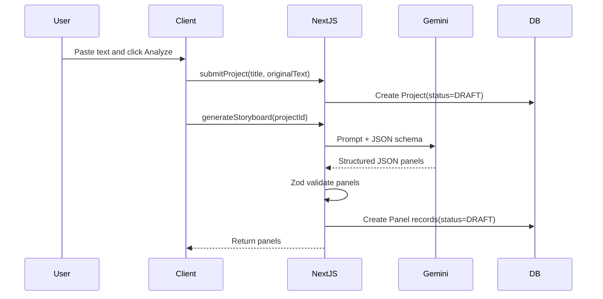
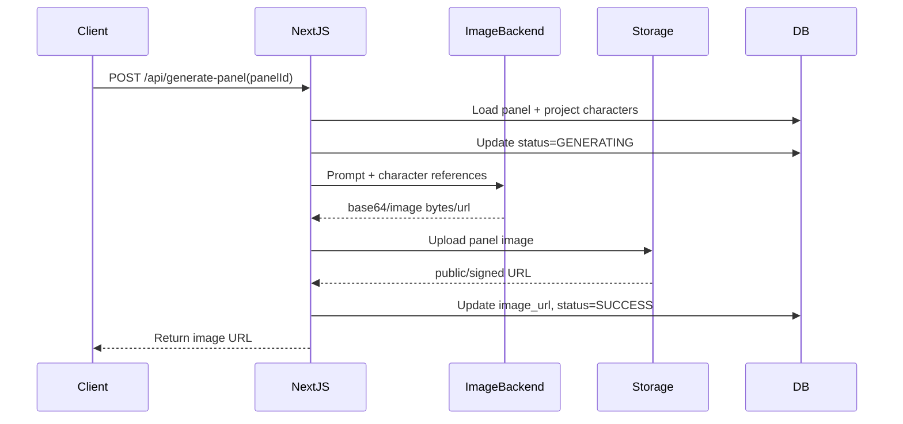

# Software Design Document (SDD): Text-to-Comic App

## 1. Architecture Goals

Hệ thống ưu tiên hoàn thành MVP đồ án: nhập truyện chữ, tạo storyboard, tạo ảnh panel, chỉnh speech bubble và export. Kiến trúc cần đủ đơn giản để nhóm sinh viên triển khai trong 5 tuần, nhưng vẫn xử lý được các rủi ro AI như timeout, quota, JSON lỗi và image backend offline.

## 2. High-Level Design

Ứng dụng dùng **Modular Monolith** với **Next.js App Router**. Next.js đảm nhiệm UI, server actions/API routes và orchestration với Supabase + AI services.



## 3. Tech Stack Decisions

| Area            | Choice                                                  | Reason                                                              |
| --------------- | ------------------------------------------------------- | ------------------------------------------------------------------- |
| Framework       | Next.js App Router + TypeScript                         | Full-stack trong một repo, dễ demo/deploy                           |
| UI              | Tailwind CSS + shadcn/ui                                | Tốc độ triển khai nhanh, consistent components                      |
| Auth/DB/Storage | Supabase                                                | Auth, Postgres, Storage có free tier phù hợp demo                   |
| ORM             | Prisma hoặc Supabase client typed queries               | Prisma dễ quản schema; Supabase client thuận tiện RLS               |
| Text AI         | Gemini Flash model hiện có                              | Free tier tốt cho demo, hỗ trợ structured JSON                      |
| Image AI        | Hugging Face/Inference Providers hoặc Colab ComfyUI     | Basic path dễ tích hợp; Colab path hỗ trợ control/reference tốt hơn |
| Validation      | Zod                                                     | Validate request body và AI JSON                                    |
| Export          | html-to-image/canvas pipeline cho PNG dọc; PDF optional | PNG là MVP ít rủi ro hơn PDF                                        |

## 4. Data Model



### Notes

- MVP có thể bỏ entity `Scene` để giảm độ phức tạp; mỗi `Panel` là một slice user-facing.
- Nếu sau này cần chapter/scene hierarchy, thêm `Scene` giữa `Project` và `Panel`.
- Local-first runtime lưu `speech_bubbles` trong `Panel.bubbles`; DB production dài hạn có thể tách bảng `BUBBLE`, còn Supabase baseline hiện có thể lưu JSONB.
- Supabase RLS cần đảm bảo user chỉ đọc/ghi project của mình.

## 5. Core Flows

### 5.1. Text-to-Storyboard



Error handling:

- JSON invalid: retry once with repair prompt, then return validation error.
- Quota/rate limit: return typed error `AI_TEXT_QUOTA`.
- Safety block: return typed error `AI_TEXT_POLICY_BLOCK`.

### 5.2. Panel Image Generation



Generation rules:

- `Generate All` gọi từng panel tuần tự từ client để tránh serverless timeout.
- Nếu một panel lỗi, các panel thành công vẫn giữ nguyên.
- Regenerate chỉ thay ảnh cũ sau khi ảnh mới upload thành công.
- Nếu image backend offline, panel chuyển `ERROR` với message rõ ràng.

### 5.3. Speech Bubble Editing

Client dùng editor kéo thả để cập nhật `speech_bubbles` theo panel. Dữ liệu cần autosave hoặc save on change với debounce để reload project không mất bubble.

### 5.4. Export PNG

MVP export trên client bằng canvas/html-to-image:

1. Load panels theo `order_index`.
2. Render image + speech bubbles.
3. Ghép dọc thành một canvas lớn.
4. Download PNG.

PDF export có thể được thêm sau bằng jsPDF hoặc server-side rendering, nhưng không chặn MVP.

## 6. API Contracts

### `POST /api/storyboard`

Request:

```json
{
  "storyTitle": "string",
  "storyText": "string"
}
```

Response:

```json
{
  "pages": [],
  "source": "gemini",
  "warning": "string"
}
```

### `POST /api/generate-panel`

Request:

```json
{
  "panel": {},
  "characters": []
}
```

Response:

```json
{
  "panelId": "string",
  "imageUrl": "string",
  "source": "image-backend",
  "warning": "string"
}
```

Error response:

```json
{
  "code": "AI_IMAGE_OFFLINE",
  "message": "Image backend is offline. Please retry later.",
  "retryable": true
}
```

## 7. Risk Controls

| Risk                                 | Control                                                                |
| ------------------------------------ | ---------------------------------------------------------------------- |
| Serverless timeout khi tạo nhiều ảnh | Client-side sequential generation                                      |
| Colab/ngrok đổi URL                  | Lưu endpoint trong env/admin config, hiển thị trạng thái offline       |
| Free tier hết quota                  | Typed error, retry later, demo cache/mock data                         |
| AI trả dữ liệu sai schema            | Zod validation + repair retry                                          |
| User truy cập project người khác     | Supabase RLS + server-side ownership check                             |
| Prompt injection trong truyện chữ    | Treat story text as data, schema-constrained output, no tool execution |
| Upload ảnh reference không phù hợp   | File type/size validation, optional content moderation                 |

## 8. Implementation Priority

1. Project creation + storyboard JSON.
2. Storyboard editor with persistent panels.
3. Generate one panel.
4. Generate all sequentially + regenerate panel.
5. Speech bubble persistence.
6. PNG export.
7. Auth/dashboard/PDF/advanced character consistency as remaining scope.
