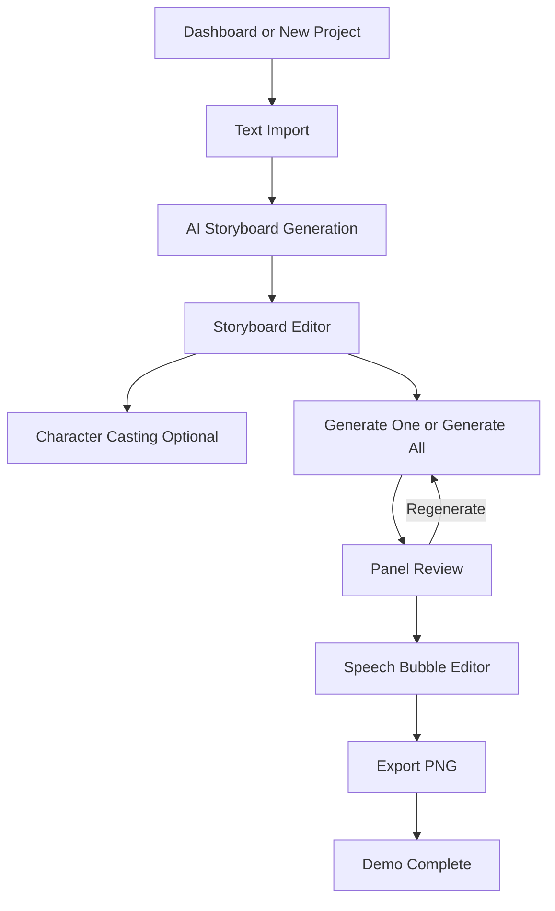

# Tài Liệu Thiết Kế UI/UX: Text-to-Comic App

## 1. UX Principles

- **Human-in-the-loop first:** AI tạo bản nháp, người dùng luôn có điểm can thiệp để sửa prompt, dialogue, ảnh và speech bubble.
- **Progress is visible:** Tạo ảnh có thể chậm, nên mỗi panel cần trạng thái rõ: draft, queued, generating, success, error.
- **Recoverable errors:** Lỗi quota, timeout, Colab offline hoặc policy block không được làm mất storyboard.
- **MVP over magic:** Ưu tiên editor thủ công ổn định hơn các tính năng thông minh nhưng rủi ro như tự đặt bubble.
- **Creator workspace:** Giao diện nên giống công cụ làm việc sáng tạo, không phải landing page hay demo tĩnh.

## 2. Design System

Ứng dụng dùng dark workspace để làm nổi bật ảnh comic, nhưng cần tránh một màu tím/dark slate quá đơn điệu.

### Color Roles
- **Background:** `#09090b`
- **Surface:** `#18181b`
- **Elevated Surface:** `#27272a`
- **Primary:** `#8b5cf6` dùng cho hành động AI chính.
- **Success/Generate:** `#10b981`
- **Warning:** `#f59e0b`
- **Error:** `#ef4444`
- **Text Primary:** `#f4f4f5`
- **Text Secondary:** `#a1a1aa`

### Typography
- **UI:** Inter hoặc Outfit.
- **Comic bubble:** Font comic open-license nếu có; `Comic Sans MS` chỉ dùng fallback prototype.
- **Text sizing:** Panel/editor dùng cỡ chữ vừa phải, tránh hero-scale trong workspace.

### Components
- Icon buttons cho regenerate, delete, move, export.
- Tooltip cho icon ít quen thuộc.
- Segmented control cho style selection nếu triển khai.
- Toast/banner cho lỗi hệ thống AI.
- Progress row hoặc inline panel status cho queue generation.

## 3. Core User Flow

## 4. Key Screens

### 4.1. Text Import

Purpose: giúp người dùng bắt đầu nhanh và hiểu giới hạn demo.

Required elements:
- Project title input.
- Large story textarea.
- Character/text length indicator.
- Primary action: `Analyze Story`.
- Warning nếu text quá dài.

Empty/error states:
- Empty text: yêu cầu nhập truyện.
- Too long: đề nghị rút ngắn hoặc chia chương.
- AI text quota/policy: hiển thị lỗi và giữ nội dung đã nhập.

### 4.2. Storyboard Editor

Purpose: nơi người dùng kiểm tra và sửa output của LLM trước khi tạo ảnh.

Layout:
- Left sidebar: Character Casting.
- Main area: vertical list of panel cards.
- Bottom/sticky toolbar: Generate All, Save, Export status.

Panel card requirements:
- Panel number/order.
- Editable scene prompt.
- Editable dialogue.
- Character chips.
- Image preview area.
- Status badge: Draft, Generating, Done, Error.
- Actions: Generate, Regenerate, Delete.

Error states:
- JSON parse error: retry analyze.
- Panel generation error: show reason, retry only this panel.
- Image backend offline: show global banner and per-panel error.

### 4.3. Character Casting

Purpose: tăng character consistency mà không làm MVP phụ thuộc hoàn toàn vào IP-Adapter.

Required fields:
- Character name.
- Short visual description.
- Optional reference image upload.

Behavior:
- Nếu backend hỗ trợ reference image, gửi image URL.
- Nếu không, dùng description trong prompt.
- User vẫn có thể generate panel khi chưa thêm character.

### 4.4. Comic/Speech Bubble Editor

Purpose: chỉnh bản comic sau khi có ảnh.

Required behavior:
- Add bubble.
- Edit bubble text.
- Drag bubble position.
- Delete bubble.
- Save bubble coordinates per panel.
- Preview gần giống kết quả export.

Out of MVP:
- Auto-detect empty area.
- Complex shape library.
- Multi-page print layout.

### 4.5. Export

MVP:
- Export PNG dọc theo thứ tự panel.
- Include speech bubbles.
- Warn if some panels are missing images.

Should-have:
- PDF export.
- Export progress modal.

## 5. Responsive Behavior

- Desktop is primary for editor workflow.
- Tablet/mobile should remain usable for viewing and light edits.
- On small screens, left sidebar becomes drawer.
- Panel card stacks vertically: text editor above image preview.
- Toolbar actions collapse into menu if width is limited.

## 6. Prototype Alignment

Current `prototype/index.html` already demonstrates:
- Dark creator workspace.
- Character Casting sidebar.
- Storyboard panel cards.
- Generating state.
- Generate/regenerate/export controls.

Needed refinements when converting to React:
- Add Text Import screen before editor.
- Add explicit empty/error states.
- Replace static sample data with typed project/panel data.
- Add responsive layout rules.
- Ensure button text and labels fit on mobile.
- Add `aria-label`/tooltip for icon-only buttons.

## 7. Frontend Component Backlog

| Component | Priority | Notes |
| --- | --- | --- |
| `AppShell` | Must | Nav/workspace layout |
| `ProjectDashboard` | Should | List projects |
| `TextImportForm` | Must | Create project and analyze |
| `StoryboardPanelCard` | Must | Prompt/dialogue/status/actions |
| `GenerationStatusBanner` | Must | AI offline/quota/policy errors |
| `CharacterCastingPanel` | Should | Character reference |
| `PanelImagePreview` | Must | Image/loading/error state |
| `SpeechBubbleEditor` | Must | Manual bubble editing |
| `ExportModal` | Must for PNG | Progress + missing panel warning |
| `StyleSelector` | Could | Bonus only |

## 8. UX Acceptance Checklist

- User can complete demo without reading technical instructions.
- Every long-running AI action has visible progress.
- Every AI failure has a retry path or fallback.
- Storyboard is saved before image generation starts.
- Regenerate affects only one panel.
- Export works with the same visual order shown in editor.
