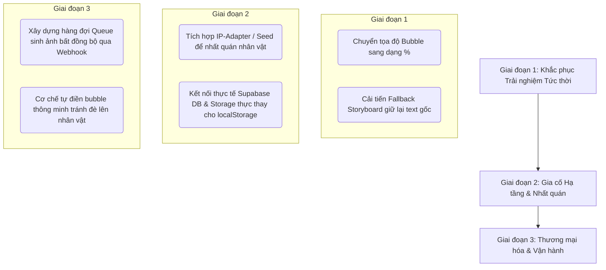

# BÁO CÁO ĐÁNH GIÁ CHUYÊN SÂU DỰ ÁN TEXT-TO-COMIC APP
*Người thực hiện: Antigravity AI (Phân vai: Architecture Doctor, Product Manager, Business Analyst, System Analyst, Solution Architect)*

> [!WARNING]
> **CẢNH BÁO QUAN TRỌNG TỪ NGƯỜI DÙNG**: Tài liệu và mã nguồn hiện tại có thể tồn tại những điểm không chính xác hoặc chưa đáp ứng đúng nhu cầu thực tế của người dùng cuối. Báo cáo này tập trung vào việc **mổ xẻ và vạch trần các lỗ hổng ẩn sâu** giữa thiết kế lý thuyết so với trải nghiệm thực tế.

---

## I. ĐIỂM SỐ SỨC KHỎE KIẾN TRÚC & NỢ KỸ THUẬT (Architecture Doctor Diagnose 🩺)

Sau khi kiểm định toàn bộ mã nguồn Next.js và chạy thành công **39/39 Unit Tests** cùng **ESLint**, chúng tôi đánh giá mức độ lành mạnh kỹ thuật (Technical Health) của hệ thống như sau:

### 1. Điểm số SQALE & Health Metrics

| Tiêu chí | Điểm số | Vấn đề cốt lõi phát hiện | Mức độ rủi ro |
| :--- | :---: | :--- | :---: |
| **Tính Modular (Modularity)** | **85/100** | Tách biệt tốt Client-Side Hooks (`useComicStudioState`) và Server-Side Adapters. | Thấp |
| **Tính Nhất Quán Dữ Liệu (Coupling & State)** | **65/100** | Client gánh toàn bộ state quản lý ứng dụng, `localStorage` snapshot phình to và khó quản lý phiên bản khi Schema cập nhật. | Trung bình |
| **Mức Độ Kiểm Thử (Test Coverage)** | **90/100** | Rất tốt. 39 unit tests chạy ổn định (<1s), bao quát từ persistence đến xuất bản canvas. | Thấp |
| **Khoản nợ kỹ thuật (Technical Debt)** | **SQALE: 6 ngày công** | Thiếu lớp kết nối DB Supabase thực tế mặc dù tài liệu mô tả rất sâu về nó. | Cao |

### 2. Phân tích chi tiết Nợ Kỹ Thuật (Tech Debt Anatomy)
- **"Supabase Mirage" (Lỗ hổng Supabase ảo)**: File `supabase/schema.sql` có tồn tại, nhưng toàn bộ logic lưu trữ thực tế vẫn chỉ chạy qua `localStorage` (`LocalStorageStudioRepository` trong `lib/studio/persistence.ts`). Nếu deploy thực tế, việc tích hợp Supabase đòi hỏi viết lại toàn bộ tầng Repository của Client và Server Action, ước tính tốn **4 ngày công**.
- **"The Lost Compass" Fallback (Mất dữ liệu câu chuyện khi AI lỗi)**: Tại `lib/server/gemini-storyboard.ts`, khi Gemini phân tích JSON lỗi (hoặc hết hạn mức), hệ thống sẽ nhảy thẳng sang hàm fallback `createFallbackStoryboardResponse`, trả về một cốt truyện mẫu cố định ("The Lost Compass"). Điều này khiến toàn bộ nội dung người dùng nhập vào bị ghi đè bằng truyện mẫu. Đúng ra phải có bộ parser bóc tách thủ công từ text thô để giữ nguyên ý tưởng của người dùng.

---

## II. ĐÁNH GIÁ TỪ GÓC NHÌN QUẢN LÝ SẢN PHẨM (Product Manager 🚀)

### 1. Lỗ hổng Character Consistency (Tính nhất quán nhân vật)
*   **Thực tế phát triển**: Casting Sidebar cho phép người dùng định nghĩa mô tả nhân vật, nhưng trong mã nguồn xử lý ảnh (`lib/server/image-generation.ts` dòng 79-95), hệ thống chỉ đơn giản ghép văn bản mô tả vào prompt chung: `name: description`.
*   **Nhu cầu thực tế của người dùng**: AI vẽ nhân vật thay đổi khuôn mặt và quần áo liên tục qua các panel là nguyên nhân số 1 khiến người dùng từ bỏ các app làm comic bằng AI.
*   **Giải pháp đề xuất**: Phải tích hợp cơ chế gieo seed ngẫu nhiên cố định (Consistent Seed) hoặc hỗ trợ truyền tham chiếu ảnh thực tế (IP-Adapter / ControlNet) thay vì chỉ mô tả bằng text.

### 2. Sự bó buộc về số lượng Panel (3 - 6 Panels)
*   **Thực tế phát triển**: Gemini bị giới hạn cứng tại schema JSON (`minItems: 3, maxItems: 6` trong `gemini-storyboard.ts`).
*   **Nhu cầu thực tế**: Người viết truyện muốn chuyển thể một chương dài 2,000 từ cần ít nhất 15-20 panels. Giới hạn 6 panels khiến ứng dụng chỉ dừng lại ở mức làm meme hoặc truyện cười siêu ngắn.

---

## III. ĐÁNH GIÁ TỪ GÓC NHÌN PHÂN TÍCH NGHIỆP VỤ (Business Analyst 📊)

### 1. Thiếu hụt Nghiệp vụ Hạn mức (AI Quota & Cost Control)
*   Tài liệu PRD ghi nhận rủi ro hết hạn mức (free tier), nhưng hệ thống chưa có giao diện hoặc cơ chế cho phép người dùng tự cấu hình API Key của riêng họ tại Client (Bring Your Own Key - BYOK).
*   Nếu triển khai thực tế, chi phí sinh ảnh (Image Generation) sẽ nhanh chóng làm sập dự án nếu không có lớp nghiệp vụ giới hạn lượt dùng thử (Rate Limiting per IP) hoặc gói trả phí.

### 2. Quy trình xử lý lỗi sinh ảnh chưa tối ưu
*   Khi người dùng chạy "Generate All" (Sinh ảnh đồng loạt), ứng dụng gọi tuần tự từng panel để tránh timeout. Tuy nhiên, nếu panel thứ 2 bị lỗi, UI chỉ đổi badge sang đỏ nhưng không tự động thử lại (Retry) hoặc bỏ qua thông minh. Người dùng phải bấm click thủ công từng panel bị lỗi.

---

## IV. ĐÁNH GIÁ TỪ GÓC NHÌN PHÂN TÍCH HỆ THỐNG (System Analyst 💻)

### 1. Rủi ro Phồng và Lỗi Phiên bản Dữ liệu lưu trữ (LocalStorage Bloat)
*   Snapshot lưu trữ cục bộ chứa cả dữ liệu Base64 của các ảnh fallback cũ. Điều này khiến bộ nhớ `localStorage` (giới hạn 5MB) rất dễ bị tràn sau 2-3 dự án.
*   Thiếu tầng Migration dữ liệu: Khi cấu trúc `StudioSnapshot` thay đổi ở phiên bản tiếp theo, toàn bộ dữ liệu cũ của người dùng trong trình duyệt sẽ gây crash app do hàm check kiểu nghiêm ngặt `isStudioSnapshot` (dòng 105 trong `persistence.ts`) trả về `false` và xóa sạch dữ liệu.

### 2. Lỗ hổng thiết kế Speech Bubble Coordinates (Tọa độ bong bóng thoại)
*   Tọa độ bong bóng thoại `(x, y)` được lưu dưới dạng pixel tĩnh tương đối trên khung canvas hiện tại. Khi xuất ảnh PNG với độ phân giải lớn hơn hoặc hiển thị trên màn hình di động phản hồi (Responsive), vị trí bong bóng thoại sẽ bị lệch hoàn toàn khỏi nhân vật. Tọa độ bắt buộc phải lưu dưới dạng phần trăm `(%)` tương đối so với kích thước ảnh gốc.

---

## V. ĐÁNH GIÁ TỪ GÓC NHÌN KIẾN TRÚC SƯ GIẢI PHÁP (Solution Architect 🏗️)

### 1. Client-Driven Generation (Client làm nhạc trưởng)
*   **Thiết kế hiện tại**: Client quản lý vòng lặp gọi tuần tự API để tạo ảnh (`generateAll` tuần tự).
*   **Đánh giá**: Ưu điểm là tránh được Serverless Timeout 10s của Vercel. Nhược điểm là nếu người dùng tắt tab trình duyệt giữa chừng, toàn bộ tiến trình sẽ bị gãy và dữ liệu rơi vào trạng thái không nhất quán.
*   **Kiến trúc tối ưu**: Nên chuyển sang mô hình xử lý bất đồng bộ hàng đợi (Queue-based Background Jobs) kết hợp Webhook/SSE (Server-Sent Events) để cập nhật trạng thái panel theo thời gian thực.

### 2. Điểm nghẽn Adapter AI
*   Lớp API Adapter được bọc rất sạch bằng Zod Schema. Tuy nhiên, API sinh ảnh `/api/generate-panel` đang gọi trực tiếp đến `IMAGE_BACKEND_URL` một cách đồng bộ. Nếu backend GPU (Colab ComfyUI/Hugging Face) phản hồi chậm quá 10 giây, API này sẽ lập tức bị Gateway Timeout trên các nền tảng deploy cloud thông thường.

---

## VI. LỘ TRÌNH ĐIỀU TRỊ KHUYẾN NGHỊ (Treatment Plan 📋)

Để đưa dự án từ mức "Nguyên mẫu Demo" (Academic Prototype) lên sản phẩm thương mại có khả năng đáp ứng nhu cầu thực tế của người dùng, chúng tôi đề xuất lộ trình tái cấu trúc 3 giai đoạn:

### Chi tiết các hành động ưu tiên cao (Fix Now)
1.  **Sửa đổi cơ chế tọa độ bong bóng thoại**: Chuyển đổi công thức lưu trữ từ pixels sang phần trăm (`x_percent`, `y_percent`) để đảm bảo responsive và xuất ảnh độ phân giải cao không bị lệch.
2.  **Khắc phục lỗi ghi đè Fallback**: Khi Gemini Parser lỗi, hãy tự động trích xuất các câu thoại bằng Regex thô từ đoạn text của chính người dùng thay vì thay thế bằng câu chuyện mẫu "The Lost Compass".
3.  **Tích hợp Supabase thực tế**: Loại bỏ dần sự phụ thuộc vào `localStorage`, đồng bộ hóa state lên database thực để đảm bảo tính an toàn dữ liệu.
