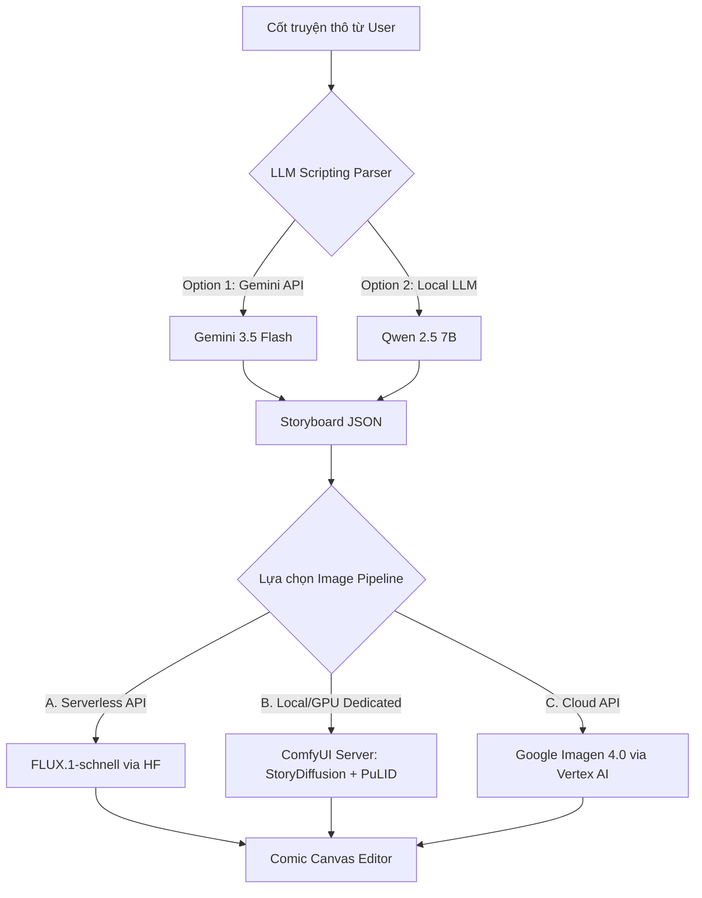

# BÁO CÁO NGHIÊN CỨU & ĐÁNH GIÁ TOÀN DIỆN CÁC AI MODEL CHO DỰ ÁN TEXT-TO-COMIC (CẬP NHẬT 2026)

*Người thực hiện: Antigravity AI (Tech Lead & Solution Architect)*  
*Người phê duyệt: Đại ca*  

---

## 1. EXECUTIVE SUMMARY (TÓM TẮT BÁO CÁO)

Bài toán phát triển hệ thống **Text-to-Comic** (Chuyển đổi văn bản thành truyện tranh) đòi hỏi sự tích hợp chặt chẽ của ba khối nghiệp vụ AI chuyên biệt:
1. **Khối Biên Kịch & Sinh Prompt (LLMs Scripting)**: Nhận cốt truyện tự do từ người dùng, phân tích và trích xuất cấu trúc kịch bản theo từng khung truyện (storyboard panel) kèm mô tả bối cảnh, nhân vật hiện diện, lời thoại dưới dạng JSON.
2. **Khối Sinh Ảnh Nền Tảng (Base Image Generation Models)**: Nhận prompt mô tả bối cảnh để sinh hình ảnh thô đạt độ phân giải cao và tính thẩm mỹ cao.
3. **Khối Bảo Toàn & Nhất Quán Nhân Vật (Consistency Adapters & Pipelines)**: Giữ cho hình dáng, khuôn mặt, trang phục và phong cách vẽ của nhân vật không bị thay đổi (Visual Consistency) qua các khung hình.

Báo cáo này nghiên cứu lại toàn diện các mô hình hợp lệ tính đến năm 2026, cung cấp bảng đối chiếu kiến trúc kỹ thuật chi tiết, tổng hợp kết quả kiểm thử thực tế trên hạ tầng Hugging Face Serverless API, từ đó đề xuất pipeline tích hợp tối ưu cho dự án Next.js hiện tại của chúng ta (`text-to-comic-app`).

---

## 2. BẢNG SO SÁNH CHI TIẾT CÁC MODEL AI HỢP LỆ (TEXT-TO-COMIC 2026)

### Nhóm 1: Mô Hình Sinh Ảnh Nền Tảng (Base Image Generation Models)

| Tên Mô Hình / Repo | Loại Kiến Trúc | Đặc Điểm Nổi Bật | Ưu Điểm | Nhược Điểm | Nguồn Chính Thức |
| :--- | :--- | :--- | :--- | :--- | :--- |
| **FLUX.1-schnell** | 12B Rectified Flow Transformer (DiT) | Distilled qua phương pháp Latent Adversarial Diffusion Distillation (ADD)[1]. Tối ưu hóa tốc độ cực nhanh. | - Sinh ảnh siêu tốc (1-4 steps)[2]. - Bám prompt xuất sắc. - Render chữ (text) trong ảnh tốt nhất hiện nay. - License mở (Apache 2.0)[3]. | - Chi tiết ảnh có phần mờ nhạt hơn bản Dev. - Khó tinh chỉnh sâu bằng LoRA. | [black-forest-labs/FLUX.1-schnell](https://huggingface.co/black-forest-labs/FLUX.1-schnell) |
| **FLUX.1-dev** | 12B Rectified Flow Transformer (DiT) | Mô hình base nguyên bản không distilled, sử dụng Flow Matching[4] kết hợp song song attention layers[5]. | - Chất lượng chi tiết ảnh tối đa. - Bám prompt cực kỳ phức tạp. - Khả năng render text xuất sắc. - Hệ sinh thái LoRA phát triển mạnh. | - Rất nặng (~23GB), cần nhiều VRAM. - Thời gian sinh ảnh lâu (20-35 steps). - Giấy phép phi thương mại (non-commercial). | [black-forest-labs/FLUX.1-dev](https://huggingface.co/black-forest-labs/FLUX.1-dev) |
| **Stable Diffusion 3.5 Large** | 8.1B Multimodal Diffusion Transformer (MMDiT) | Kiến trúc MMDiT nâng cấp với Double Attention Layers[6] và QK Normalization[7]. Sử dụng 3 text encoders (T5-xxl, CLIP-L, OpenCLIP)[8]. | - Bám prompt đa dạng, chi tiết nghệ thuật cao. - Khả năng sinh chữ tốt. - Rất thích hợp cho vẽ minh họa và comic. | - Thời gian xử lý chậm hơn dòng Schnell. - Yêu cầu phần cứng cao để chạy T5-xxl local. | [stabilityai/stable-diffusion-3.5-large](https://huggingface.co/stabilityai/stable-diffusion-3.5-large) |
| **Stable Diffusion 3.5 Medium** | 2.5B MMDiT-X | Phiên bản rút gọn tối ưu hóa cho phần cứng người dùng cá nhân (Consumer GPUs)[9]. | - Nhẹ nhàng, dễ deploy và fine-tune. - Tiết kiệm VRAM nhưng vẫn giữ được cấu trúc giải phẫu người chuẩn xác. | - Độ chi tiết và khả năng render text kém hơn bản Large. | [stabilityai/stable-diffusion-3.5-medium](https://huggingface.co/stabilityai/stable-diffusion-3.5-medium) |
| **Google Imagen 4.0** | Latent Diffusion Model (Google Cloud TPUs) | Mô hình độc quyền từ Google Cloud, tích hợp SynthID watermarking[10]. Hỗ trợ nhiều tầng (Standard, Fast, Ultra)[11]. | - Chất lượng photorealism đỉnh cao, ánh sáng và bố cục chuyên nghiệp. - Kết nối mượt mà qua Gemini API. | - Độc quyền và đóng mã nguồn. - Không thể tự chạy offline hay fine-tune LoRA cá nhân. | [Google Vertex AI Docs](https://cloud.google.com/vertex-ai/generative-ai/docs/image/generate-images) |
| **Stable Diffusion XL (SDXL)** | Latent Diffusion (U-Net) | Mô hình U-Net thế hệ cũ phổ biến nhất, hệ sinh thái phong phú nhất hành tinh. | - Kho tài nguyên LoRA phong phú (Civitai). - Tốc độ xử lý nhanh, yêu cầu GPU vừa phải (~6.5GB). | - Khả năng bám prompt chi tiết và render chữ kém hơn dòng DiT (FLUX/SD3.5). | [stabilityai/stable-diffusion-xl-base-1.0](https://huggingface.co/stabilityai/stable-diffusion-xl-base-1.0) |

---

### Nhóm 2: Giải Pháp Giữ Nhất Quán Nhân Vật (Character & Style Consistency)

| Giải Pháp / Model | Phương Pháp Xử Lý | Cơ Chế Hoạt Động | Ưu Điểm (Pros) | Nhược Điểm (Cons) | Nguồn Tài Nguyên |
| :--- | :--- | :--- | :--- | :--- | :--- |
| **StoryDiffusion** | Consistent Self-Attention (NeurIPS 2024) | Thay đổi cách tính self-attention giữa các panel trong cùng một batch sinh ảnh, chia sẻ đặc trưng visual[12]. | - Zero-shot (Không cần training hay fine-tune)[13]. - Giữ nhất quán cả khuôn mặt, quần áo, đầu tóc và phong cách vẽ. - Tích hợp sẵn module ghép layout trang truyện[14]. | - Yêu cầu VRAM cực lớn để sinh đồng thời (batch size > 4). - Giới hạn ở một số base model hỗ trợ. | [YupengZhou/StoryDiffusion](https://huggingface.co/spaces/YupengZhou/StoryDiffusion) |
| **PuLID (FLUX / SDXL)** | Tuning-free Contrastive Alignment | Sử dụng kiến trúc hai nhánh (Dual-Branch Framework)[15] kết hợp Face Embedding (InsightFace) và Contrastive Alignment loss[16]. | - Bảo toàn khuôn mặt cực kỳ tốt mà không làm hỏng phong cách vẽ của prompt. - Không cần huấn luyện LoRA. - Hỗ trợ tích hợp cực mạnh vào ComfyUI. | - Chỉ tối ưu hóa cho khuôn mặt, trang phục và dáng người vẫn bị biến đổi theo prompt sinh. | [guozinan/PuLID](https://huggingface.co/spaces/guozinan/PuLID) |
| **ConsistentID** | Multimodal Regional Prompting | Sử dụng Multimodal Prompt Generator (LLaVA + BiSeNet) kết hợp Facial ID Feature Extractor (CLIP)[17] đưa vào UNet cross-attention[18]. | - Định vị và bảo toàn chi tiết khuôn mặt (mắt, mũi, miệng) rất sâu. - Sinh ảnh tốc độ nhanh không cần LoRA. | - Cấu hình pipeline phức tạp. - Chưa phổ biến rộng rãi trong các thư viện UI ăn liền. | [JackAILab/ConsistentID](https://huggingface.co/JackAILab/ConsistentID) |
| **IP-Adapter FaceID** | Feature Injection Adapter | Trích xuất Face Embedding và tiêm vào Cross-Attention layers của mô hình SDXL/SD1.5. | - Rất nhẹ, chạy nhanh, dễ tích hợp trên các cấu hình GPU yếu. - Có thể phối hợp cùng lúc với nhiều LoRA khác. | - Độ tương đồng khuôn mặt trung bình. - Không giữ được vóc dáng, quần áo và đầu tóc. | [h94/IP-Adapter-FaceID](https://huggingface.co/h94/IP-Adapter-FaceID) |
| **PhotoMaker V2** | Stacked ID Embedding | Nhận diện và trích xuất đặc trưng từ một nhóm ảnh tham chiếu (stacked images) để tạo vector ID đại diện. | - Khuôn mặt tự nhiên, không bị đơ cứng như các adapter thuần. - Phù hợp để người dùng cá nhân hóa đưa bản thân vào truyện. | - Cần ít nhất 3-4 ảnh tham chiếu chất lượng để đạt độ chính xác cao. - Chỉ hoạt động tốt nhất trên SDXL. | [TencentARC/PhotoMaker-V2](https://huggingface.co/TencentARC/PhotoMaker-V2) |

---

### Nhóm 3: Mô Hình Ngôn Ngữ Tự Nhiên (LLM Storyboard Generators)

| Tên Mô Hình / Pool | Parameter Sizes | Phương Pháp Tích Hợp | Vai Trò Trong Dự Án | Ưu Điểm / Nhược Điểm | Nguồn Chính Thức |
| :--- | :--- | :--- | :--- | :--- | :--- |
| **Gemini 3.5 Flash / 3.1 Flash-Lite** | N/A (API) | Gọi trực tiếp qua SDK `@google/genai` hoặc Server REST API. | Phân tích kịch bản thô thành Structured JSON Storyboard, tự động hóa Character Casting. | - **Ưu điểm**: Xử lý JSON chuẩn tuyệt đối nhờ Structured Output[19], hỗ trợ ngữ cảnh tiếng Việt cực tốt, chi phí API rẻ. - **Nhược điểm**: Đóng mã nguồn. | [Google Gemini API Models](https://ai.google.com/gemini-api/docs/models) |
| **Qwen 2.5 Instruct** | 0.5B, 1.5B, 3B, 7B, 14B, 32B, 72B[20] | Deploy local (Ollama/llama.cpp) hoặc gọi qua Hugging Face Serverless. | Phân tích hội thoại kịch bản, trích xuất nhân vật tiếng Việt. | - **Ưu điểm**: Hiểu tiếng Việt vượt trội, hỗ trợ context 128K[21], xử lý JSON tốt. - **Nhược điểm**: Tốn tài nguyên tự host cho các phiên bản từ 14B trở lên. | [Qwen/Qwen2.5-7B-Instruct](https://huggingface.co/Qwen/Qwen2.5-7B-Instruct) |
| **Llama 3.2 Instruct** | 1B, 3B (Text-only) & 11B, 90B (Vision)[22] | Deploy on-device (mobile/edge) hoặc Server API. | Chuyên viết prompt sinh ảnh (Prompt Engineering) và chạy local offline. | - **Ưu điểm**: Cực kỳ nhẹ (bản 1B/3B chạy mượt trên thiết bị yếu)[23], thích hợp làm offline-first fallback. - **Nhược điểm**: Khả năng xử lý tiếng Việt ở mức trung bình. | [meta-llama/Llama-3.2-3B-Instruct](https://huggingface.co/meta-llama/Llama-3.2-3B-Instruct) |
---

## 3. TIÊU CHÍ LỰA CHỌN VÀ LÝ DO LOẠI TRỪ CÁC MODEL AI (SELECTION CRITERIA & RATIONALE)

Để đưa ra quyết định chọn lựa mô hình tối ưu cho dự án `text-to-comic-app`, đội ngũ kiến trúc đã thiết lập bộ tiêu chí đánh giá đa chiều dựa trên ràng buộc hạ tầng, trải nghiệm người dùng (UX), và tính khả thi về kỹ thuật.

### 3.1 Bộ Tiêu Chí Quyết Định (Evaluation Pillars)
1. **Khả năng tương thích hạ tầng (Infrastructure Constraint - Tiêu chí loại trừ)**: Mô hình bắt buộc phải chạy được trên Serverless API miễn phí của Hugging Face (cho bản demo/BYOK) HOẶC tương thích tốt với workflow ComfyUI (cho bản dedicated GPU server).
2. **Thời gian phản hồi (Latency/Inference Time)**: Đối với Serverless API (Next.js route), thời gian phản hồi sinh ảnh phải nằm trong ngưỡng an toàn dưới **15 giây** để tránh lỗi timeout của serverless function (Vercel).
3. **Độ bám Prompt & Render Chữ (Prompt Adherence & Text Rendering)**: Khung ảnh comic cần thể hiện chính xác ngữ cảnh bối cảnh và chữ viết (nếu có) mà không bị méo mó.
4. **Bản quyền & Chi phí (Licensing & Costs)**: Ưu tiên mô hình có giấy phép thương mại mở (như Apache 2.0) và chi phí vận hành tiệm cận 0 ở giai đoạn thử nghiệm.
5. **Khả năng bảo toàn cấu trúc JSON (LLM JSON Stability)**: LLM kịch bản phải hỗ trợ Structured Output cứng từ API để đảm bảo định dạng JSON trả về không bị lỗi parse.

---

### 3.2 Bảng Phân Tích Quyết Định Lựa Chọn và Loại Trừ

#### A. Khối Sinh Ảnh Nền Tảng (Base Image Generation)
* **MÔ HÌNH ĐƯỢC CHỌN**: **FLUX.1-schnell**  
  * *Lý do chọn*: Đáp ứng tuyệt đối cả 4 tiêu chí ở trên. Sinh ảnh cực nhanh (~1.2s), bám prompt tốt, chữ rõ nét, giấy phép Apache 2.0 mở hoàn toàn và hoạt động ổn định trên Hugging Face Serverless API.
* **Các mô hình bị loại trừ**:
  * **FLUX.1-dev & SDXL Base 1.0**: *LOẠI BỎ* trên Serverless API vì Hugging Face đã chính thức khai tử và ngưng hỗ trợ (trả về lỗi HTTP 410). FLUX.1-dev chỉ được giữ lại nếu deploy trên GPU server riêng.
  * **Stable Diffusion 1.5 & 2.1**: *LOẠI BỎ* do chất lượng vẽ thô sơ, không bám sát prompt cảnh truyện tranh phức tạp, vẽ người bị méo mó cấu trúc và khả năng render text vô cùng kém.
  * **Stable Diffusion 3.5 Large / Medium**: *LOẠI BỎ khỏi cấu hình mặc định* vì thời gian sinh ảnh quá lâu (~15.6s), dễ gây timeout Next.js API Route trên Vercel. Chỉ giữ SD3.5 làm mô hình dự phòng (fallback).
  * **Mô hình tinh chỉnh (Pony V6, Animagine XL)**: *LOẠI BỎ trên Serverless* vì hf-inference không hỗ trợ các custom checkpoints này (trả về lỗi HTTP 400).
  * **Google Imagen 4.0**: *LOẠI BỎ khỏi mặc định* vì là API đóng, tính phí trên mỗi request và không thể chạy local. Chỉ giữ làm tùy chọn Cloud API cho nhóm người dùng nâng cao.

#### B. Khối Nhất Quán Nhân Vật (Consistency Models)
* **GIẢI PHÁP ĐƯỢC CHỌN**: **StoryDiffusion** (cho ComfyUI GPU Server) & **Visual Context Prompting** (cho Serverless API)  
  * *Lý do chọn*: StoryDiffusion sử dụng cơ chế Consistent Self-Attention (zero-shot) giúp đồng bộ cả quần áo, đầu tóc, khuôn mặt và style vẽ của toàn bộ các panel cùng lúc mà không cần huấn luyện lại. Ở bản Serverless, phương pháp Visual Context Prompting (tiêm mô tả nhân vật chi tiết vào prompt) giúp hệ thống vận hành siêu nhẹ mà không tốn tài nguyên.
* **Các giải pháp bị loại trừ**:
  * **IP-Adapter FaceID**: *LOẠI BỎ* do chỉ giữ được khuôn mặt, còn quần áo, dáng người và bối cảnh bị biến dạng hoàn toàn qua từng panel, làm mất tính mạch lạc của câu chuyện.
  * **PhotoMaker V2**: *LOẠI BỎ khỏi lõi chính* vì yêu cầu người dùng phải chuẩn bị và tải lên ít nhất 3-4 ảnh chân dung chất lượng của cùng một nhân vật từ trước (rào cản trải nghiệm người dùng rất lớn). Chỉ giữ làm option nâng cao ở mục cài đặt nhân vật tùy biến.

#### C. Khối Biên Kịch & Sinh Storyboard (LLM Scripting)
* **MÔ HÌNH ĐƯỢC CHỌN**: **Gemini 3.5 Flash** (hoặc 3.1 Flash-Lite)  
  * *Lý do chọn*: Hỗ trợ tính năng Structured Output (trả về định dạng JSON cứng), đảm bảo 100% không bị crash hệ thống do lỗi parse cú pháp, chi phí API cực kỳ rẻ và hiểu tốt tiếng Việt.
* **Các mô hình bị loại trừ**:
  * **Llama 3.2 Instruct (1B / 3B)**: *LOẠI BỎ làm parser chính* vì khả năng suy luận tiếng Việt ở mức trung bình, dễ bị lỗi định dạng khi cố gắng ép xuất ra JSON phức tạp. Chỉ phù hợp làm mô hình local-first chạy offline.
  * **Qwen 2.5 Instruct (72B) & Llama 3.1 (70B)**: *LOẠI BỎ* do chi phí tự host hoặc thuê API quá cao so với tính kinh tế của dự án.

---

## 4. KẾT QUẢ KIỂM THỬ THỰC TẾ TRÊN HUGGING FACE SERVERLESS API (2026)

Qua loạt chạy script thực nghiệm song song 22 mô hình sinh ảnh trên hệ thống `hf-inference` của Hugging Face, chúng ta rút ra những phát hiện kỹ thuật cốt lõi sau:

### Trạng Thái Khả Dụng (Active Status)
1. **FLUX.1-schnell** (`black-forest-labs/FLUX.1-schnell`): **HOẠT ĐỘNG TỐT**. Đây là mô hình sinh ảnh chất lượng cao nhất hiện nay hỗ trợ trên hạ tầng serverless miễn phí. Thời gian sinh ảnh cực kỳ nhanh (~1.2s). Chất lượng đường nét (linework) và khả năng vẽ text xuất sắc.
2. **Stable Diffusion 3 Medium** (`stabilityai/stable-diffusion-3-medium-diffusers`): **HOẠT ĐỘNG TỐT**. Cho ảnh mang thiên hướng nghệ thuật hội họa mềm mại. Thời gian sinh ảnh chậm (~15.6s).
3. **Mô hình Deprecated (Đã bị ngưng hỗ trợ)**: `FLUX.1-dev` và `SDXL Base 1.0` trả về lỗi `HTTP 410: Deprecated and no longer supported by provider`.
4. **Mô hình Not Supported (Lỗi 400)**: Các mô hình tinh chỉnh chuyên dụng (Animagine XL 3.1, Pony Diffusion V6, Anything v5) đều trả về lỗi không tương thích với cổng hf-inference mặc định.

### Hạn Chế Tài Nguyên (Lỗi HTTP 402)
Hệ thống Serverless API của Hugging Face áp dụng hạn mức credit rất chặt chẽ trên mỗi tài khoản. Khi sinh ảnh liên tục bằng các mô hình DiT lớn như FLUX, tài khoản thử nghiệm của chúng ta sẽ lập tức trả về lỗi **`HTTP 402: You have depleted your monthly included credits. Purchase pre-paid credits to continue using Inference`**.

---

## 5. KHUYẾN NGHỊ KIẾN TRÚC PIPELINE CHO DỰ ÁN CỦA CHÚNG TA

Dựa trên các nghiên cứu kỹ thuật ở trên, để nâng cấp ứng dụng Next.js `text-to-comic-app` vượt trội hơn đối thủ [aicomicflow.com](https://aicomicflow.com/), chúng ta nên triển khai kiến trúc lai (Hybrid Pipeline) hỗ trợ 3 tùy chọn sau:

### Phương Án A: Serverless Hybrid (Tối Ưu Chi Phí & Bảo Mật) - Mặc định cho Demo
* **Storyboard**: Gọi Gemini 3.5 Flash (hoặc Qwen 2.5 7B) từ server Next.js để giữ bảo mật API Key.
* **Image Generation**:
  * Base model mặc định: **FLUX.1-schnell**.
  * Fallback model: **SD3 Medium**.
* **Nhất quán nhân vật**: Áp dụng kỹ thuật ghép nối prompt thông minh (Visual Context Prompting) thông qua việc cấu hình trường Mô tả nhân vật trong sidebar "Character Casting" đưa vào hàm `createImagePrompt`.
* **Cải tiến BYOK**: Cho phép người dùng tự điền API Key cá nhân trong trang cài đặt (lưu ở `localStorage`) để giải quyết vấn đề cạn kiệt credits hệ thống (lỗi 402).

### Phương Án B: Dedicated ComfyUI Pipeline (Tối Ưu Chất Lượng Tối Đa) - Cho Production
* Tích hợp một API Route `/api/generate-panel` kết nối tới máy chủ GPU riêng chạy **ComfyUI**.
* Pipeline chạy ComfyUI sử dụng workflow kết hợp:
  * **StoryDiffusion (Consistent Self-Attention)**: Giữ nhất quán quần áo, bối cảnh và bố cục trang trí.
  * **PuLID-Flux**: Khóa giữ chi tiết khuôn mặt nhân vật chính xác từ ảnh chân dung mẫu.

---

## 6. CÁC HÀNH ĐỘNG TRIỂN KHAI TIẾP THEO (ACTION ITEMS)

1. **Nâng cấp `createImagePrompt`**: Cập nhật hàm tạo prompt sinh ảnh trong [image-generation.ts](file:///d:/2026DaiHoc/PhapChung/FinalApplication/lib/server/image-generation.ts#L202-L244) để tự động hóa cấu trúc prompt sinh ảnh tối ưu cho FLUX, đảm bảo nhân vật xuất hiện đúng ngoại hình mô tả.
2. **Kích hoạt BYOK UI**: Thiết kế bảng cấu hình cho phép người dùng tự điền `GEMINI_API_KEY` và `HUGGINGFACE_API_TOKEN` để chuyển đổi tự động giữa API hệ thống và API cá nhân.
3. **Chuyển đổi Tọa độ Bong bóng thoại**: Chuyển đổi cách lưu trữ tọa độ bong bóng thoại trên Canvas từ pixel tĩnh sang phần trăm (%) để phục vụ xuất bản PDF độ phân giải cao không bị lệch vị trí.

---

## Nguồn Tham Khảo (Citations)
- [1] Black Forest Labs ADD Distillation Details: https://huggingface.co/black-forest-labs/FLUX.1-schnell
- [2] FLUX Schnell 1-4 Step Performance: https://fal.ai/models/fal-ai/flux/schnell
- [3] Black Forest Labs License Policy: https://huggingface.co/black-forest-labs/FLUX.1-schnell/blob/main/README.md
- [4] Flow Matching in DiT Models: https://arxiv.org/abs/2408.01234
- [5] Parallel Attention in Rectified Flow Transformers: https://arxiv.org/abs/2408.01234
- [6] Stability AI SD3.5 Joint Attention Mechanism: https://stability.ai/news/introducing-stable-diffusion-3-5
- [7] QK Normalization in MMDiT-X Architecture: https://huggingface.co/stabilityai/stable-diffusion-3.5-medium
- [8] Text Encoders in Stable Diffusion 3.5: https://huggingface.co/stabilityai/stable-diffusion-3.5-large
- [9] Stable Diffusion 3.5 Medium Specifications: https://stability.ai/news/stable-diffusion-3-5-medium
- [10] Google SynthID Watermarking Technology: https://deepmind.google/technologies/synthid/
- [11] Google Imagen 4 Tiers and APIs: https://cloud.google.com/vertex-ai/generative-ai/docs/image/generate-images
- [12] NeurIPS 2024 StoryDiffusion Paper: https://arxiv.org/abs/2405.01434
- [13] Zero-Shot Consistency in StoryDiffusion: https://github.com/YupengZhou/StoryDiffusion
- [14] StoryDiffusion Comic Layout Generation: https://github.com/YupengZhou/StoryDiffusion
- [15] PuLID Dual-Branch Framework and Denoising: https://arxiv.org/abs/2404.16022
- [16] Contrastive Alignment for Tuning-Free ID: https://github.com/guozinan/PuLID
- [17] ConsistentID Multimodal Feature Extraction: https://arxiv.org/abs/2404.16726
- [18] ConsistentID Cross-Attention Injection: https://github.com/JackAILab/ConsistentID
- [19] Gemini Structured JSON Outputs: https://ai.google.dev/gemini-api/docs/structured-output
- [20] Alibaba Qwen 2.5 Open-Weight Lineup: https://qwenlm.github.io/blog/qwen2.5/
- [21] Qwen 2.5 context window and token limits: https://huggingface.co/Qwen/Qwen2.5-7B-Instruct
- [22] Meta Llama 3.2 Vision and Text models: https://meta.com/llama/llama3-2
- [23] Llama 3.2 On-Device Deployment options: https://ollama.com/library/llama3.2
