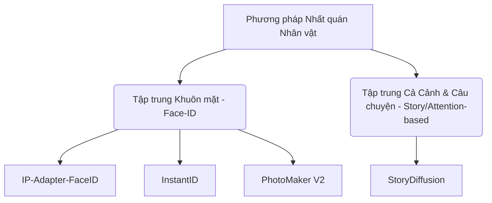

# BÁO CÁO NGHIÊN CỨU & ĐÁNH GIÁ CÁC MODEL AI CHO DỰ ÁN TEXT-TO-COMIC TRÊN HUGGING FACE

*Người thực hiện: Antigravity AI (Phân vai: Tech Lead & Solution Architect)*

---

## 1. EXECUTIVE SUMMARY (TÓM TẮT BÁO CÁO)

Dự án sinh truyện tranh từ văn bản (**Text-to-Comic**) đòi hỏi sự kết hợp phức tạp giữa hai tác vụ AI cốt lõi:
1. **Trình biên dịch kịch bản (Scripting & Prompting)**: Chuyển đổi câu chuyện thô (Raw text) thành các panel truyện có mô tả bối cảnh, lời thoại và mô tả nhân vật.
2. **Trình sinh ảnh nhất quán (Consistent Image Generation)**: Tạo ra các hình ảnh panel tuân thủ phong cách truyện tranh đã chọn (Art style) và duy trì được đặc điểm ngoại hình của nhân vật xuyên suốt câu chuyện (Character Consistency).

Báo cáo này nghiên cứu các mô hình chất lượng nhất hiện nay trên **Hugging Face** (tính đến năm 2026) được chia làm 4 nhóm chính:
- **Base Models**: Mô hình sinh ảnh nền tảng.
- **Fine-tuned Styles**: Mô hình hoặc LoRA chuyên cho nét vẽ comic/manga/anime.
- **Consistency Models**: Các adapter và pipeline giữ nhất quán nhân vật.
- **LLM Generators**: Mô hình ngôn ngữ hỗ trợ phân tích cốt truyện.

Từ đó, báo cáo đề xuất các pipeline tối ưu để tích hợp trực tiếp vào dự án Next.js hiện tại của chúng ta (`text-to-comic-app`).

---

## 2. DETAILED ANALYSIS (PHÂN TÍCH CHI TIẾT CÁC MÔ HÌNH HUGGING FACE)

### Nhóm 1: Mô Hình Sinh Ảnh Nền Tảng (Base Models)

Đây là các mô hình nền tảng chịu trách nhiệm chuyển prompt mô tả cảnh thành hình ảnh thô trước khi áp dụng style hay kỹ thuật nhất quán nhân vật.

| Model / Repository | Loại | Ưu điểm | Nhược điểm | Đường dẫn Hugging Face |
| :--- | :--- | :--- | :--- | :--- |
| **FLUX.1-dev** | DiT (Diffusion Transformer) | Chất lượng ảnh đỉnh cao, độ chi tiết cao, bám prompt xuất sắc, render văn bản (chữ trong panel) cực tốt. | Dung lượng lớn (~23GB), thời gian sinh ảnh chậm và yêu cầu phần cứng GPU rất cao. | [black-forest-labs/FLUX.1-dev](https://huggingface.co/black-forest-labs/FLUX.1-dev) |
| **FLUX.1-schnell** | DiT (Distilled) | Sinh ảnh cực nhanh (chỉ từ 1 - 4 steps), chất lượng tiệm cận bản dev, giấy phép thương mại mở (Apache 2.0). | Ít chi tiết hơn bản Dev, khó tinh chỉnh (fine-tune) sâu bằng LoRA. | [black-forest-labs/FLUX.1-schnell](https://huggingface.co/black-forest-labs/FLUX.1-schnell) |
| **Stable Diffusion XL (SDXL)** | Latent Diffusion | Hệ sinh thái LoRA/ControlNet phong phú nhất, tài nguyên vừa phải (~6.5GB), tốc độ xử lý nhanh, hỗ trợ đa dạng style. | Khả năng bám prompt phức tạp và render text kém hơn dòng FLUX. | [stabilityai/stable-diffusion-xl-base-1.0](https://huggingface.co/stabilityai/stable-diffusion-xl-base-1.0) |
| **Stable Diffusion 1.5** | Latent Diffusion | Siêu nhẹ (~2GB - 4GB), có thể chạy được trên cấu hình yếu (hoặc chạy client-side qua WebGPU), cộng đồng hỗ trợ lớn. | Chất lượng vẽ thô sơ, độ phân giải thấp (512x512 mặc định), bám prompt kém ở các cảnh phức tạp. | [runwayml/stable-diffusion-v1-5](https://huggingface.co/runwayml/stable-diffusion-v1-5) |

> [!WARNING]
> **Cập nhật thực tế kiểm thử (15/06/2026)**: Qua thực tế chạy song song các mô hình bằng script `compare-models.ts`, ngoại trừ **FLUX.1-schnell** hoạt động tốt, các mô hình Stable Diffusion cũ (SD 1.5, SDXL 1.0) và các bản fine-tuned (Animagine XL 3.1, Pony V6) **đều đã bị Hugging Face ngưng hỗ trợ hoặc báo lỗi không tương thích trên cổng Serverless Inference API miễn phí** (hf-inference provider).

---

### Nhóm 2: Mô Hình Fine-Tuned & LoRA Chuyên Phong Cách Truyện Tranh (Art Styles)

Để ảnh sinh ra mang đúng chất comic, manga hay anime, chúng ta cần sử dụng các mô hình đã được tinh chỉnh hoặc bổ sung các LoRA style chuyên biệt.

#### 1. Phong cách Anime / Manga Nhật Bản (Japanese Manga/Anime Style)
- **Animagine XL 3.1** ([cagliostrolab/animagine-xl-3.1](https://huggingface.co/cagliostrolab/animagine-xl-3.1)):
  * *Đặc điểm*: Dựa trên SDXL, là mô hình tốt nhất để vẽ phong cách anime chất lượng cao. Hỗ trợ tốt các thẻ tag phong cách (danbooru tags) giúp điều khiển tư thế và bối cảnh chuẩn xác.
- **Pony Diffusion V6 XL** ([AstraliteHeart/pony-diffusion-v6](https://huggingface.co/AstraliteHeart/pony-diffusion-v6)):
  * *Đặc điểm*: Mô hình SDXL tùy biến sâu, nổi tiếng với khả năng bám prompt tuyệt đối và cực kỳ linh hoạt trong việc thể hiện các style hội họa khác nhau (từ anime cổ điển, hiện đại đến phong cách cartoon phương Tây).

#### 2. Phong cách Truyện Tranh Âu Mỹ & Cổ Điển (Western & Retro Comic Style)
- **Comic-Style-LoRA-FLUX.1dev** ([borozkut/Comic-Style-LoRA-FLUX.1dev](https://huggingface.co/borozkut/Comic-Style-LoRA-FLUX.1dev)):
  * *Đặc điểm*: LoRA dành riêng cho FLUX.1-dev. Giúp định hình ảnh sinh ra có nét vẽ mực đậm (bold linework), tô màu phẳng/khối rõ ràng (color blocking) và bóng đổ gai góc đặc trưng của truyện tranh hiện đại.
- **Retro Comic Flux** ([renderartist/retrocomicflux](https://huggingface.co/renderartist/retrocomicflux)):
  * *Đặc điểm*: Phiên bản LoRA cho FLUX mang đến hiệu ứng truyện tranh xưa cũ với kỹ thuật in chấm màu (halftone style), tạo cảm giác hoài cổ như đọc các bộ truyện Marvel/DC thập niên 80.
- **Comic Diffusion (SD 1.5)** ([ogkalu/Comic-Diffusion](https://huggingface.co/ogkalu/Comic-Diffusion)):
  * *Đặc điểm*: Mô hình tinh chỉnh trên nền SD 1.5, tuy cũ hơn nhưng rất nhẹ nhàng để tích hợp cho các máy chủ GPU yếu, chuyên trị vẽ các nhân vật siêu anh hùng với phong cách vẽ chì đậm nét.

---

### Nhóm 3: Mô Hình & Giải Pháp Nhất Quán Nhân Vật (Character & Style Consistency)

*Đây là rào cản lớn nhất khi làm ứng dụng Comic AI. Nếu mỗi panel nhân vật lại mang một khuôn mặt khác nhau, truyện tranh sẽ mất đi tính thuyết phục.*

#### 1. StoryDiffusion (Đề xuất hàng đầu cho truyện tranh)
- **Hugging Face Repository**: [YupengZhou/StoryDiffusion](https://huggingface.co/spaces/YupengZhou/StoryDiffusion)
- **Cơ chế hoạt động**: Sử dụng giải pháp **Consistent Self-Attention**. Thay vì xử lý từng bức ảnh đơn lẻ, nó thực hiện liên kết chéo (cross-attention) toàn bộ các ảnh panel trong một mẻ (batch) sinh.
- **Điểm mạnh**:
  * Không cần huấn luyện lại hay fine-tune mô hình.
  * Giữ nhất quán không chỉ khuôn mặt mà cả trang phục, màu tóc và phong cách chung của nhân vật xuyên suốt các panel.
  * Có sẵn module bố cục trang truyện (Comic Generation module) ghép các panel thành một trang hoàn chỉnh.
- **Điểm yếu**: Tiêu tốn nhiều VRAM của GPU khi sinh đồng thời nhiều ảnh panel trong cùng một mẻ.

#### 2. IP-Adapter-FaceID (Tốc độ & Gọn nhẹ)
- **Hugging Face Repository**: [h94/IP-Adapter-FaceID](https://huggingface.co/h94/IP-Adapter-FaceID)
- **Cơ chế hoạt động**: Sử dụng mô hình nhận diện khuôn mặt (InsightFace) để trích xuất embedding khuôn mặt từ 1 bức ảnh chụp nhân vật mẫu, sau đó tiêm (inject) embedding này vào Stable Diffusion như một dạng image prompt bổ sung.
- **Điểm mạnh**: cực kỳ nhẹ, chạy nhanh, có thể kết hợp linh hoạt với bất kỳ checkpoint SDXL hay SD 1.5 nào khác.
- **Điểm yếu**: Chỉ giữ được khuôn mặt, không giữ được quần áo, đầu tóc hay vóc dáng cơ thể.

#### 3. InstantID (Độ chính xác khuôn mặt tối đa)
- **Hugging Face Repository**: [InstantX/InstantID](https://huggingface.co/InstantX/InstantID)
- **Cơ chế hoạt động**: Kết hợp Face Embedding mạnh mẽ và kiến trúc ControlNet để kiểm soát cả cấu trúc khuôn mặt và dáng điệu (pose).
- **Điểm mạnh**: Độ tương đồng khuôn mặt cực kỳ cao ngay cả với góc nghiêng hoặc biểu cảm phức tạp.
- **Điểm yếu**: Cấu hình phức tạp hơn IP-Adapter và thường yêu cầu SDXL làm nền tảng.

#### 4. PhotoMaker V2 (Tự nhiên & Hỗ trợ Stack Ảnh)
- **Hugging Face Repository**: [TencentARC/PhotoMaker-V2](https://huggingface.co/TencentARC/PhotoMaker-V2)
- **Cơ chế hoạt động**: Cho phép người dùng tải lên nhiều bức ảnh tham chiếu (ví dụ: góc thẳng, góc nghiêng, các biểu cảm của cùng một nhân vật) để tổng hợp thành một ID duy nhất.
- **Điểm mạnh**: Cho ra khuôn mặt tự nhiên, ít bị "đơ" cứng hơn InstantID và khả năng tùy biến giới tính/độ tuổi rất mượt mà.
- **Điểm yếu**: Chỉ tối ưu tốt trên SDXL và cần ít nhất vài bức ảnh tham chiếu chất lượng để đạt độ chính xác cao.

---

### Nhóm 4: Mô Hình Ngôn Ngữ Tự Nhiên (LLM) Cho Storyboard Generator

Các mô hình này được gọi ở API Route `/api/storyboard` để nhận câu chuyện thô, phân tích cấu trúc kịch bản và xuất ra mảng JSON chứa thông tin từng panel (mô tả cảnh, nhân vật hiện diện, lời thoại).

- **Qwen 2.5 Instruct (7B / 14B)** ([Qwen/Qwen2.5-7B-Instruct](https://huggingface.co/Qwen/Qwen2.5-7B-Instruct)):
  * *Đặc điểm*: Khả năng xử lý tiếng Việt cực tốt, tạo cấu trúc JSON chuẩn xác và ít bị lỗi định dạng hơn Llama khi thực thi thông qua API dạng streaming/JSON-mode.
- **Llama 3.1 / 3.2 Instruct (8B)** ([meta-llama/Llama-3.1-8B-Instruct](https://huggingface.co/meta-llama/Llama-3.1-8B-Instruct)):
  * *Đặc điểm*: Mô hình lý tưởng để viết prompt sinh ảnh (Image Prompt Engineering). Nó có thể nhận dạng nhân vật thô và chuyển thể thành các prompt mô tả chi tiết phù hợp với Stable Diffusion.

---

## 3. RECOMMENDATIONS & PIPELINE ARCHITECTURE (KHUYẾN NGHỊ TRIỂN KHAI)

Dự án Next.js hiện tại (`text-to-comic-app`) nên thiết lập và hỗ trợ 3 tùy chọn pipeline sinh ảnh (Image Generation Pipeline) để phục vụ cho các nhóm người dùng và cấu hình hạ tầng khác nhau:

### Phương án A: Serverless API Pipeline (Tối ưu Chi phí cho Đồ án/Thử nghiệm)
*Phù hợp khi triển khai trên Vercel không có máy chủ GPU riêng.*

*   **Storyboard Generation**: Gọi Gemini API (hoặc Hugging Face Serverless API với **Qwen 2.5 7B**).
*   **Image Generation**: Gọi Hugging Face Serverless Inference API.
    *   *Base Model*: **FLUX.1-schnell** (Lưu ý: Không dùng `cagliostrolab/animagine-xl-3.1` hay `stabilityai/stable-diffusion-xl-base-1.0` vì đã bị ngừng hỗ trợ trên Serverless API miễn phí).
    *   *Consistency*: Sử dụng prompt cấu trúc cố định (Name + Description) kết hợp khóa Visual Context (Character Reference URL) trong prompt.
*   *Đánh giá*: Chi phí vận hành gần như bằng 0, không sợ timeout server vì ảnh được sinh bất đồng bộ thông qua client gọi trực tiếp hoặc polling API ngắn hạn.

### Phương án B: GPU Server Pipeline với ComfyUI (Tối ưu Độ nhất quán câu chuyện)
*Phù hợp khi người dùng có máy chủ GPU riêng (ví dụ: máy cá nhân chạy cục bộ, Google Colab Pro hoặc RunPod).*

*   **Kiến trúc backend**: Next.js API gửi request đến endpoint ComfyUI API.
*   **Pipeline xử lý trong ComfyUI**:
    *   Sử dụng workflow **ComfyUI-StoryDiffusion** làm lõi.
    *   Nhận danh sách 4 - 6 prompt panel từ Next.js, đưa vào node *StoryDiffusion Sampler* để sinh đồng thời cả bộ ảnh panel.
    *   Tự động giữ đồng bộ trang phục và gương mặt nhân vật.
*   *Đánh giá*: Giải pháp chuyên nghiệp nhất cho một ứng dụng Comic AI thực thụ. Đảm bảo chất lượng truyện xuất xưởng ở mức cao nhất.

### Phương án C: Advanced Face-ID Pipeline (Tối ưu hóa BYOK - Bring Your Own Key)
*Dành cho người dùng tự cấu hình API Key và ảnh chân dung cá nhân (để đưa chính mình vào truyện tranh).*

*   **Kiến trúc**:
    *   Người dùng tải lên 1 ảnh khuôn mặt của mình làm nhân vật chính.
    *   Sử dụng **PhotoMaker-V2** hoặc **InstantID** tích hợp tại GPU endpoint để map khuôn mặt người dùng vào các panel truyện tranh theo phong cách vẽ đã chọn.
*   *Đánh giá*: Tính năng cá nhân hóa cao, dễ tạo viral marketing (ví dụ: "Biến bản thân thành siêu anh hùng").

---

## 4. ACTION ITEMS (CÁC BƯỚC TRIỂN KHAI TIẾP THEO CHO DỰ ÁN)

1. **Cập nhật Cấu hình Settings**: Thêm trường lựa chọn Mô hình sinh ảnh (SDXL Anime, SDXL Western, FLUX Retro, Custom ComfyUI API) trong giao diện cài đặt của `text-to-comic-app`.
2. **Triển khai Prompt Generator Module**: Tạo một file utility `promptHelper.ts` để tối ưu hóa việc ghép nối mô tả nhân vật từ Character Casting vào prompt sinh ảnh (như khuyến nghị tại báo cáo [Analysis-aicomicflow.md](file:///d:/2026DaiHoc/PhapChung/FinalApplication/docs/050-Research/Analysis-aicomicflow.md)).
3. **Thử nghiệm API Endpoint**: Thiết lập một API route `/api/generate-panel` để gọi thử nghiệm Hugging Face Inference API sử dụng mô hình `cagliostrolab/animagine-xl-3.1` hoặc các LoRA đã được liệt kê ở trên.
