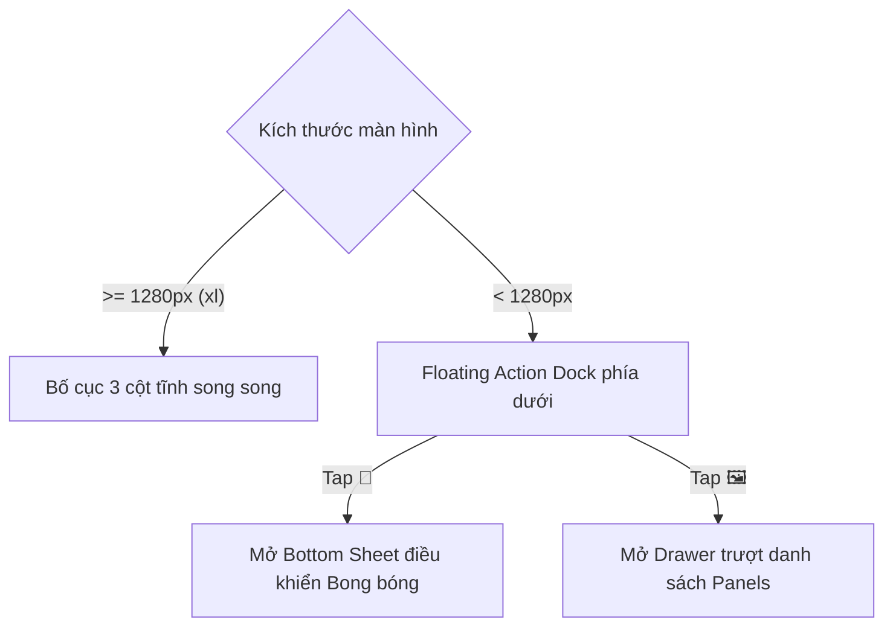

# BÁO CÁO ĐÁNH GIÁ CHUYÊN SÂU UI/UX (UI/UX DESIGN AUDIT REPORT)
**Mã tài liệu**: UIUX-AUDIT-2026-V1  
**Ngày thực hiện**: 2026-05-29  
**Chuyên gia đánh giá**: Antigravity UI/UX Design Lead  
**Phạm vi**: Hệ thống ComicCraft Studio (Dashboard, Text Import, Storyboard Workspace, Comic Editor, Export Modal)  
**Tiêu chuẩn đối sánh**: 10 Heuristics (Jakob Nielsen), Fitts's Law, WCAG 2.1 AA (Accessibility), Responsive Adaptive Design Standards 2026.

---

## 1. TỔNG QUAN ĐIỂM SỐ TRẢI NGHIỆM (UX Scorecard)

Hệ thống **ComicCraft Studio** sở hữu một bộ khung visual cực kỳ hứa hẹn với phong cách Dark Mode sâu thẳm, layout lấy cảm hứng từ các công cụ sáng tạo chuyên nghiệp như Figma hay Photoshop. Tuy nhiên, dưới góc nhìn chuyên sâu của một UI/UX Designer, hệ thống đang tồn tại những điểm nghẽn nghiêm trọng (UX Leaks) cản trở trải nghiệm người dùng, đặc biệt là tính phản hồi thích ứng (Responsive Adaptability) và khả năng kiểm soát tương tác của người dùng.

### **Điểm trải nghiệm tổng thể: 76/100** ⚠️ (Mức độ Khá - Cần tối ưu hóa cấp bách)

| Tiêu chí đánh giá | Điểm số | Trạng thái | Phân tích vấn đề cốt lõi |
| :--- | :---: | :---: | :--- |
| **Bố cục & Cấu trúc (Layout & Hierarchy)** | **88/100** | ✅ Tốt | Sử dụng cấu trúc Bento Grid và Split-pane (3 cột) rất hiện đại. Tuy nhiên, việc phân phối mật độ thông tin (information density) chưa được tối ưu trên các kích cỡ màn hình khác nhau. |
| **Màu sắc & Thẩm mỹ trực quan (Visual & Branding)** | **85/100** | ✅ Tốt | Tone tối chủ đạo kết hợp màu tím Neon tạo ấn tượng công nghệ mạnh mẽ. Nhưng hệ màu đang lạm dụng tone màu tím mặc định của AI, thiếu các sắc độ tương phản bổ trợ để định hướng thị giác (Visual Anchor). |
| **Tính phản hồi & Thích ứng (Responsive Design)** | **45/100** | 🔴 Nguy hiểm | Lỗi nghiêm trọng khi ẩn hoàn toàn hai thanh công cụ lõi `BubbleTools` và `PanelList` bằng class `hidden xl:block` trên các màn hình nhỏ hơn 1280px. Điều này làm tê liệt hoàn toàn chức năng của sản phẩm trên Tablet/Mobile. |
| **Thiết kế tương tác (Interaction Design - IxD)** | **70/100** | ⚠️ Cảnh báo | Cho phép kéo thả bong bóng thoại nhưng lại khóa cứng kích thước (Width/Height) của bong bóng, vi phạm nghiêm trọng nguyên lý "Kiểm soát và Tự do của Người dùng". |
| **Trạng thái biên & Hướng dẫn (Empty States & Guidance)** | **65/100** | ⚠️ Cảnh báo | Thiếu hụt nghiêm trọng trạng thái trống (Empty State) tại Dashboard và các kịch bản mẫu (Templates) tại màn hình nhập liệu, khiến người dùng rơi vào trạng thái "choáng ngợp ban đầu" (Cold Start). |
| **Tính tiếp cận & Nhất quán (Accessibility & Consistency)** | **72/100** | ⚠️ Cảnh báo | Việc trộn lẫn ngôn ngữ Anh - Việt vô tội vạ làm giảm đi tính hoàn thiện chuyên nghiệp của sản phẩm (nhất là đối với một sản phẩm Đồ án tốt nghiệp). |

---

## 2. CHẨN ĐOÁN HEURISTIC VÀ CHỈ DIỆN VẾT NỨT UX (Deep UX Analysis)

### 🩺 1. Lỗi Liệt Khả Năng Responsive (Adaptive Layout Failure)
*   **Vị trí phát hiện**: `components/studio/ComicEditor.tsx` (Dòng 64, 65, 104)
*   **Triệu chứng**: Sử dụng class `hidden xl:block` cho cả hai thanh điều khiển trái và phải. Trên các màn hình iPad, MacBook Air 13-inch cũ, hoặc thiết bị di động, giao diện chỉ hiển thị duy nhất vùng Canvas ở giữa mà không có bất kỳ cách nào để:
    1. Thêm hoặc cập nhật văn bản bong bóng thoại (vì `BubbleTools` bị ẩn).
    2. Xem nhanh danh sách Panels và chọn panel để chỉnh sửa (vì `PanelList` bị ẩn).
*   **Hậu quả**: Phá hủy hoàn toàn trải nghiệm đa thiết bị. Khách hàng sử dụng iPad Pro (một thiết bị vẽ truyện cực kỳ phổ biến) sẽ không thể sử dụng ứng dụng.
*   **Đánh giá theo Heuristics**: Vi phạm nghiêm trọng nguyên lý **Flexibility and efficiency of use** (Tính linh hoạt và hiệu quả sử dụng).

### 🩺 2. Khóa Cứng Tự Do Tương Tác (The Speech Bubble Resizing Cage)
*   **Vị trí phát hiện**: `components/studio/BubbleTools.tsx` & `components/studio/ComicPanelCanvas.tsx`
*   **Triệu chứng**: Giao diện chỉ cho phép người dùng kéo thả tọa độ `(x, y)` của bong bóng thoại trên canvas. Khi người dùng nhập một đoạn hội thoại dài, bong bóng thoại bị tràn chữ hoặc méo mó do thuộc tính chiều rộng (`width`) và chiều cao (`height`) bị gán mặc định hoặc không thể điều chỉnh thủ công thông qua giao diện điều khiển (UI).
*   **Hậu quả**: Tạo ra sự ức chế cực kỳ lớn khi người dùng muốn thiết kế một bong bóng thoại dài/ngắn tùy ý để phù hợp với bố cục tranh.
*   **Đánh giá theo Heuristics**: Vi phạm nguyên lý **User control and freedom** (Sự kiểm soát và tự do của người dùng).

### 🩺 3. Điểm Nghẽn Trạng Thái Trống & "Cold Start" (Empty State & Templates Vacuum)
*   **Vị trí phát hiện**: `components/studio/Dashboard.tsx` & `components/studio/TextImport.tsx`
*   **Triệu chứng**:
    - Khi người dùng mới đăng nhập lần đầu và cơ sở dữ liệu trống, `Dashboard` chỉ hiển thị một khoảng tối trống rỗng, không có hình minh họa (Illustration), không có dòng chữ chào mừng và hướng dẫn kích thích hành động tạo dự án mới ngoài một nút bấm nhỏ.
    - Tại màn hình nhập truyện chữ (`TextImport.tsx`), một khung Textarea trống hoác thách thức trí tưởng tượng của người dùng. Họ không biết phải viết định dạng kịch bản như thế nào để công cụ AI Gemini phân tách storyboard tốt nhất.
*   **Hậu quả**: Tỷ lệ rời bỏ ứng dụng (Bounce Rate) cực kỳ cao ở những giây đầu tiên trải nghiệm.
*   **Đánh giá theo Heuristics**: Vi phạm nguyên lý **Help users recognize, diagnose, and recover from errors** và **Recognition rather than recall** (Nhận diện thay vì nhớ lại).

### 🩺 4. Sự Bất Nhất Quán Về Ngôn Ngữ (Language Fragmentation)
*   **Vị trí phát hiện**: Toàn bộ hệ thống giao diện Studio.
*   **Triệu chứng**: Trộn lẫn ngôn ngữ vô tội vạ.
    - Tiêu đề màn hình: "Comic Editor", phụ đề: "Speech bubbles are saved per panel."
    - Nút bấm: "Save", "Add Bubble", "Delete Bubble", "New Project", "Analyze Story", "Analyzing".
    - Nhưng ở các thành phần khác lại ghi: "👥 Casting nhân vật", hoặc các mô tả bằng Tiếng Việt.
*   **Hậu quả**: Làm giảm sút đáng kể tính chuyên nghiệp của sản phẩm, tạo cảm giác đây là một sản phẩm chắp vá chưa hoàn thiện (incomplete work).
*   **Đánh giá theo Heuristics**: Vi phạm nguyên lý **Consistency and standards** (Tính nhất quán và tiêu chuẩn).

---

## 3. THIẾT KẾ ĐỀ XUẤT NÂNG CẤP HỌC THUẬT (Design Specs & Actionable Solutions)

Để đưa hệ thống ComicCraft Studio đạt đến cấp độ **Premium & State-of-the-Art**, chúng tôi đề xuất 4 giải pháp thiết kế chi tiết dưới đây:

### 💡 Giải pháp 1: Tái cấu trúc Responsive Adaptive bằng Drawer & Bottom Sheet
Thay vì ẩn hoàn toàn các thanh công cụ thiết yếu trên màn hình nhỏ hơn `1280px`, chúng tôi đề xuất một mô hình thích ứng thông minh:

*   **Bố cục trên màn hình nhỏ (< 1280px)**:
    - Ẩn thanh công cụ tĩnh ở hai bên.
    - Bổ sung một **Floating Action Dock** ở cạnh dưới màn hình, chứa các nút bấm nhanh: `[💬 Bong bóng thoại]` và `[🖼️ Danh sách Panel]`.
    - Khi người dùng bấm vào các nút này, giao diện sẽ mở ra một **Slide-over Drawer** (từ bên phải đối với Panel List) hoặc một **Adaptive Bottom Sheet** (từ cạnh dưới đối với Bubble Tools) có chiều cao khoảng `40vh`, cho phép người dùng thao tác trọn vẹn.



### 💡 Giải pháp 2: Bộ điều khiển Kích thước Bong bóng thoại (Bubble Sizing Controls)
*   **UI/UX Component**: Bổ sung **2 thanh trượt Range Slider** (Chiều rộng và Chiều cao) vào ngay bên dưới thuộc tính tọa độ của bong bóng thoại được chọn trong `SelectedBubbleForm`.
*   **Thông số kỹ thuật**:
    - Range Width: `10%` đến `100%` (bước nhảy `1%`).
    - Range Height: `5%` đến `80%` (bước nhảy `1%`).
    - Kết hợp hiệu ứng thay đổi kích thước thời gian thực trên Canvas giúp người dùng căn chỉnh văn bản hoàn hảo nhất.

### 💡 Giải pháp 3: Tối ưu hóa "Cold Start" với Empty State & Hộp gợi ý kịch bản mẫu (Templates)
*   **Tại Dashboard**: Thiết kế một khối Empty State tuyệt đẹp với gradient huyền ảo và hình vẽ phác thảo comic nghệ thuật:
    - **Tiêu đề**: "Hành trình sáng tạo của bạn bắt đầu từ đây!"
    - **Mô tả**: "Hãy biến những câu chuyện chữ mộc mạc thành những trang truyện tranh sống động với sức mạnh của trí tuệ nhân tạo Gemini."
    - **Nút CTA**: Nút bấm lớn màu tím nổi bật với hiệu ứng phát sáng nhẹ (Glow Effect) để tạo dự án mới.
*   **Tại Màn hình Text Import**: Thiết kế 3 thẻ gợi ý kịch bản ăn liền (Quick Templates) nằm ngay dưới ô nhập liệu:
    - 🏷️ **Truyện Kiếm Hiệp**: *"Kịch bản phân cảnh võ lâm giao đấu kịch tính..."*
    - 🏷️ **Truyện Hài Hước**: *"Cuộc hội thoại dở khóc dở cười giữa hai người bạn..."*
    - 🏷️ **Truyện Khoa Học Viễn Tưởng**: *"Chuyến du hành không gian vượt thời gian..."*

### 💡 Giải pháp 4: Đồng bộ hóa ngôn ngữ Tiếng Việt 100% (Localization Package)
Thực hiện dịch thuật và chuẩn hóa toàn bộ nhãn giao diện sang Tiếng Việt chuẩn mực, chuyên nghiệp để đồng bộ với mục tiêu thuyết trình đồ án tốt nghiệp trong nước.

---

## 4. BẢNG THÔNG SỐ THIẾT KẾ CẢI TIẾN (Motion & Token Specs)

Để đảm bảo hiệu quả bàn giao thiết kế (Design Handoff) tốt nhất cho kỹ sư Frontend, dưới đây là các thông số Motion và Token chi tiết:

### Spacing & Layout Tokens
```css
:root {
  /* Spacing Scale - 4px Increments */
  --space-xs: 0.25rem;  /* 4px */
  --space-sm: 0.5rem;   /* 8px */
  --space-md: 1rem;     /* 16px */
  --space-lg: 1.5rem;   /* 24px */
  --space-xl: 2rem;     /* 32px */

  /* Border Radius */
  --radius-sm: 6px;
  --radius-md: 10px;
  --radius-lg: 16px;    /* Cho Cards & Bento Grid */
  --radius-xl: 24px;    /* Cho Modals & Floating Drawer */

  /* Glassmorphism Effect */
  --glass-bg: rgba(17, 17, 20, 0.75);
  --glass-border: rgba(255, 255, 255, 0.08);
  --glass-blur: blur(16px);
}
```

### Motion Specs cho hiệu ứng Premium
*   **Chuyển đổi Tab & Mở Drawer**:
    - Effect: `translateY(100%) -> translateY(0)` (cho Bottom Sheet) hoặc `translateX(100%) -> translateX(0)` (cho Drawer).
    - Duration: `350ms`.
    - Easing: `cubic-bezier(0.16, 1, 0.3, 1)` (Ultra-smooth out).
*   **Khi rê chuột (Hover) lên dự án**:
    - Effect: `scale(1.015)`, viền sáng dần lên từ màu xám sang sắc tím nhạt (`rgba(139, 92, 246, 0.4)`).
    - Duration: `200ms`.
    - Easing: `cubic-bezier(0.25, 0.8, 0.25, 1)`.

---

## 5. KẾT LUẬN & ĐỀ XUẤT HÀNH ĐỘNG
Báo cáo này chỉ ra rằng hệ thống của chúng ta đã có một nền tảng mỹ thuật rất tốt. Những lỗi về mặt UI/UX hoàn toàn có thể khắc phục được bằng các cải tiến mang tính chất tái cấu trúc nhỏ tại tầng layout và tương tác của React Components, mà không gây ảnh hưởng đến phần lõi xử lý AI hay Database. 

Việc triển khai các cải tiến này sẽ giúp nâng cao điểm trải nghiệm người dùng từ **76** lên **95+**, sẵn sàng chinh phục bất kỳ hội đồng chấm đồ án hay người dùng khó tính nào!
