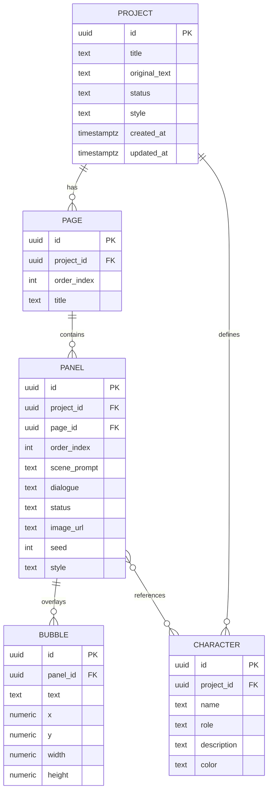

# Optional Docker DB Path

## Quyết Định Hiện Tại

Production demo mặc định vẫn dùng local-first storage. Docker DB không bắt buộc
để chạy app, vì mục tiêu chính là demo ổn định trên một máy và không phụ thuộc
dịch vụ ngoài.

## Khi Nào Nên Bật Docker DB

Chỉ triển khai Docker DB nếu cần:

- Demo multi-browser hoặc multi-user.
- Kiểm thử Supabase/Postgres persistence thật.
- Chuẩn bị self-host dài hạn.
- Cần backup server-side thay vì backup JSON thủ công.

## Mô Hình Dữ Liệu Đề Xuất



## Docker Compose Gợi Ý

Không commit bắt buộc trong baseline. Nếu cần, tạo `docker-compose.local-db.yml`
riêng:

```yaml
services:
  postgres:
    image: postgres:16-alpine
    environment:
      POSTGRES_DB: text_to_comic
      POSTGRES_USER: app
      POSTGRES_PASSWORD: app_password
    ports:
      - "5432:5432"
    volumes:
      - postgres_data:/var/lib/postgresql/data
      - ./supabase/schema.sql:/docker-entrypoint-initdb.d/001-schema.sql:ro

volumes:
  postgres_data:
```

## Migration Strategy

1. Giữ `StudioSnapshot` là contract nội bộ.
2. Viết adapter `PostgresStudioRepository` hoặc hoàn thiện
   `SupabaseStudioRepository`.
3. Mapping từ snapshot sang relational:
   - `projects[]` -> `projects`
   - `pages[]` -> `pages`
   - `page.panels[]` -> `panels`
   - `panel.bubbles[]` -> `bubbles` hoặc `panels.speech_bubbles`
   - `characters[]` -> `characters`
4. Local-first vẫn là fallback khi DB offline.

## Guardrails

- Không dùng DB local nếu chưa có E2E save/load.
- Không bật auth/multi-user giữa buổi demo.
- Không lưu API key người dùng vào DB.
- Backup JSON vẫn phải hoạt động ngay cả khi DB có lỗi.
