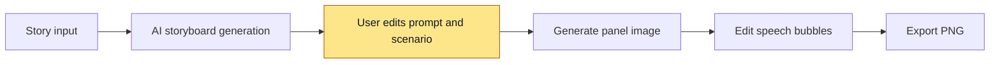
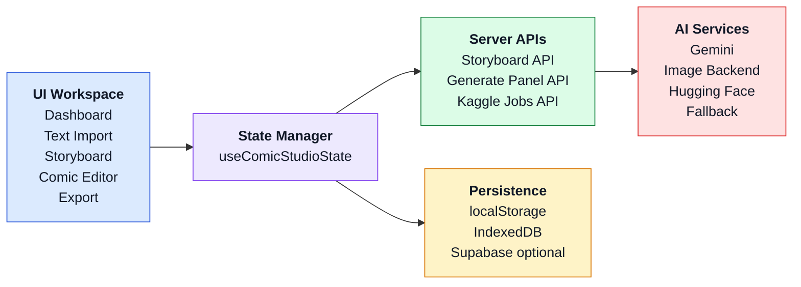
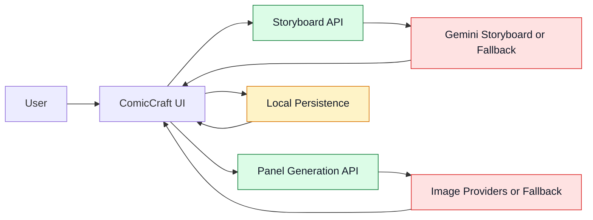
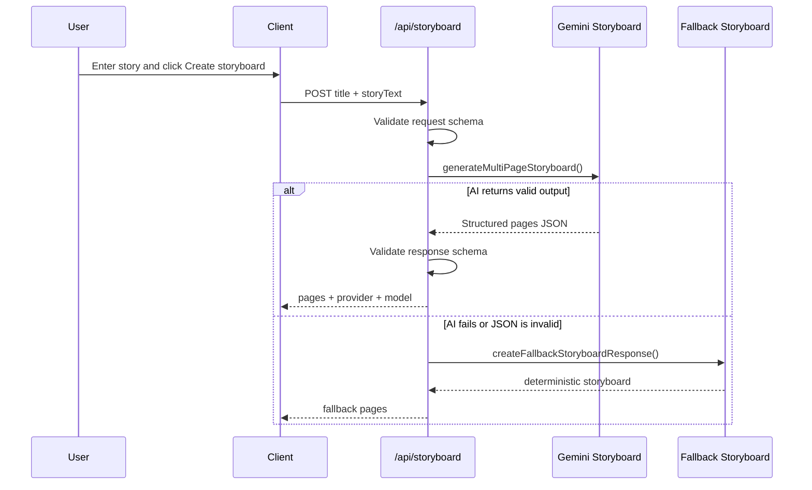
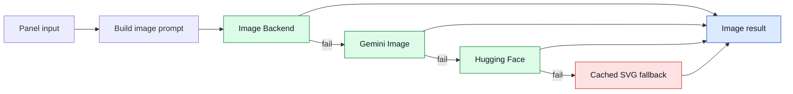
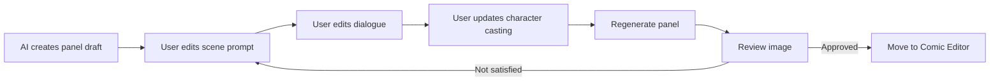
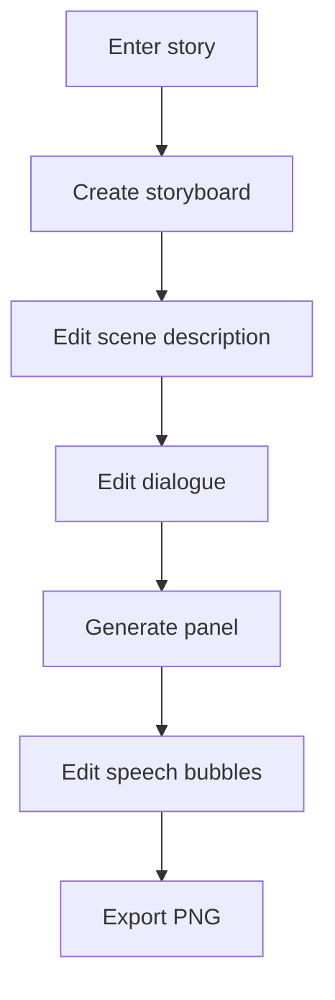
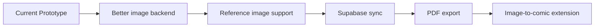

# Presentation v3: ComicCraft AI

## Ghi chú định vị

Tên trình bày dùng là **ComicCraft AI**, nhưng nội dung cần bám đúng capability hiện tại của repo:

```text
Text -> Storyboard -> Prompt chỉnh tay -> Generate panel image -> Bubble edit -> Export PNG
```

Phiên bản `v3` ưu tiên deck có tính trình bày cao hơn `v2`: ở các slide cần mô tả luồng, kiến trúc hoặc quan hệ thành phần, tài liệu này chèn sẵn diagram để có thể đưa thẳng vào slide.

## Slide 1. Trang tiêu đề

### Nội dung đặt trên slide

**ComicCraft AI**  
Ứng dụng tạo truyện tranh với AI và chỉnh sửa scenario thủ công theo prompt

ComicCraft AI là một ứng dụng web hỗ trợ chuyển đổi truyện chữ thành truyện tranh số thông qua quy trình cộng tác giữa AI và người dùng. Hệ thống được thiết kế để AI tạo bản nháp ban đầu, còn người dùng giữ quyền kiểm soát đối với scenario, prompt, lời thoại và kết quả hình ảnh ở từng khung truyện.

### Cách thể hiện

- Bố cục `hero slide`
- Bên trái: tiêu đề và đoạn mô tả ngắn
- Bên phải: screenshot lớn màn `Storyboard`
- Dưới cùng: tên nhóm, môn học, giảng viên, ngày báo cáo

## Slide 2. Động lực nghiên cứu

### Nội dung đặt trên slide

- Người dùng có ý tưởng truyện nhưng thiếu kỹ năng vẽ và thời gian dựng comic thủ công
- Công cụ AI hiện nay tạo nội dung nhanh nhưng khó kiểm soát mạch truyện, lời thoại và tính nhất quán nhân vật
- Nhu cầu thực tế là một quy trình tạo comic có thể sửa, thử lại và hoàn thiện

### Cách thể hiện

- Bố cục `3 cột vấn đề`
- Dòng chốt ở cuối slide:
  `Vấn đề không chỉ là tạo ảnh, mà là tạo comic có thể biên tập được`

## Slide 3. Phát biểu bài toán

### Nội dung đặt trên slide

- Chuyển truyện chữ thành truyện tranh số theo quy trình end-to-end
- Tận dụng AI để tạo storyboard và hình ảnh nhưng vẫn giữ quyền kiểm soát cho người dùng
- Duy trì khả năng hoạt động khi backend AI lỗi, timeout, quota hoặc offline

### Cách thể hiện

- Bố cục `problem statement`
- Tô nổi từ khóa `end-to-end`, `control`, `robustness`

## Slide 4. Mục tiêu nghiên cứu

### Nội dung đặt trên slide

- Xây dựng ứng dụng web hỗ trợ nhập truyện, tạo storyboard, sinh ảnh panel, chỉnh lời thoại và export
- Cho phép người dùng chỉnh scenario thủ công trước và sau bước sinh ảnh
- Bảo đảm hệ thống vẫn có thể hoàn tất demo khi dịch vụ AI không ổn định

### Cách thể hiện

- Bố cục `3 khối mục tiêu`
- Nhãn gợi ý: `Pipeline`, `User Control`, `Reliability`

## Slide 5. Câu hỏi nghiên cứu

### Nội dung đặt trên slide

1. AI có giúp rút ngắn thời gian tạo comic nháp không?
2. Chỉnh prompt thủ công có giúp kiểm soát kết quả tốt hơn không?
3. Fallback và validation có làm hệ thống ổn định hơn trong demo thực tế không?

### Cách thể hiện

- Bố cục `question slide`
- Dùng đánh số lớn `01 02 03`

## Slide 6. Phạm vi nghiên cứu

### Nội dung đặt trên slide

**Trong phạm vi**

- Text import
- Storyboard generation
- Panel image generation
- Character casting
- Speech bubble editor
- PNG export

**Ngoài phạm vi**

- Mạng xã hội truyện tranh
- Mobile app native
- Huấn luyện model riêng
- Chất lượng ảnh thương mại

### Cách thể hiện

- Bố cục `2 cột so sánh`

## Slide 7. Hướng tiếp cận tổng quát

### Nội dung đặt trên slide

- AI tạo bản nháp nhanh
- Người dùng giữ quyền kiểm soát nội dung
- Hệ thống ưu tiên chỉnh sửa hơn tự động hóa hoàn toàn

### Diagram



### Cách thể hiện

- Bố cục `flow slide`
- Đặt diagram ở trung tâm
- Nhấn màu ở bước `User chỉnh prompt và scenario`

## Slide 8. Tổng quan ứng dụng

### Nội dung đặt trên slide

- `Dashboard`: quản lý project
- `Text Import`: nhập truyện và chọn style
- `Storyboard Workspace`: chỉnh cảnh, lời thoại, nhân vật
- `Comic Editor`: chỉnh bubble trên ảnh
- `Export`: xuất PNG dọc

### Cách thể hiện

- Bố cục `screen gallery`
- Dùng 3 screenshot: `Import`, `Storyboard`, `Comic Editor`

## Slide 9. Các mô-đun cốt lõi của hệ thống

### Nội dung đặt trên slide

- Hệ thống đang chạy có thể được hiểu qua 5 khối chính: giao diện người dùng, bộ điều phối state, server APIs, AI services và persistence
- Mỗi khối có vai trò riêng nhưng kết nối theo một luồng đơn giản, dễ mở rộng
- Cách tổ chức này phản ánh đúng cấu trúc hiện tại của mã nguồn
- Ở phía client, `useComicStudioState` đóng vai trò orchestrator trung tâm, điều phối panel actions, navigation, persistence và AI actions

### Diagram



### Cách thể hiện

- Bố cục `horizontal architecture slide`
- Sơ đồ chạy từ trái sang phải để dễ đưa lên PowerPoint
- Mỗi block nên có màu nền khác nhau để người nghe phân biệt nhanh
- Chỉ giữ các mũi tên chính, không nối quá chi tiết

## Slide 10. Luồng vận hành của hệ thống

### Nội dung đặt trên slide

- Người dùng thao tác trên giao diện để tạo storyboard, sinh ảnh và chỉnh comic
- UI gọi hai API trung tâm là storyboard API và panel generation API
- Kết quả từ AI services quay lại giao diện, đồng thời trạng thái được lưu local-first
- `useComicStudioState` là điểm điều phối chính giúp liên kết UI events, API calls và local persistence thành một workflow thống nhất

### Diagram



### Cách thể hiện

- Bố cục `horizontal runtime flow`
- Đặt User ở ngoài cùng bên trái và kết quả quay lại UI để người xem thấy vòng vận hành
- Dùng 1 màu cho API, 1 màu cho AI services, 1 màu cho persistence
- Slide này nên nói theo logic “app đang chạy như thế nào”

## Slide 11. Luồng tạo storyboard

### Nội dung đặt trên slide

- Nhận `storyTitle` và `storyText`
- Validate request bằng schema
- Gọi Gemini storyboard nếu có key
- Parse và validate JSON trả về
- Dùng fallback storyboard nếu AI lỗi hoặc JSON không hợp lệ

### Diagram



### Cách thể hiện

- Bố cục `sequence diagram slide`
- Khi trình bày, nhấn mạnh `validation` và `fallback`

## Slide 12. Luồng sinh ảnh panel và cơ chế fallback

### Nội dung đặt trên slide

- Prompt ảnh được tạo từ `scene prompt`, `dialogue`, `character context`, `style`, `seed`
- Hệ thống thử provider theo thứ tự ưu tiên từ trái sang phải
- Nếu provider trước thất bại, hệ thống chuyển sang provider tiếp theo
- Fallback cuối cùng giúp app vẫn tiếp tục chạy khi backend ảnh không sẵn sàng

### Diagram



### Cách thể hiện

- Bố cục `horizontal fallback chain`
- Chỉ giữ một trục ưu tiên chính để người xem hiểu rất nhanh thứ tự fallback
- Tô cùng màu cho các provider chính, màu khác cho fallback cuối và kết quả trả về
- Khi trình bày, nhấn rằng hệ thống ưu tiên `graceful degradation` hơn phụ thuộc vào một backend duy nhất

## Slide 13. So sánh các mô hình hoặc backend sinh ảnh

### Nội dung đặt trên slide

| Mô hình / Backend | Điểm mạnh | Hạn chế | Mức phù hợp với đề tài |
| --- | --- | --- | --- |
| Gemini Image | Tích hợp nhanh, đồng bộ với pipeline Gemini | Khó kiểm soát sâu, phụ thuộc quota/API | Phù hợp để thử nghiệm nhanh |
| `sd-turbo` local | Chạy được local, chi phí thấp, dễ demo | Chất lượng chưa cao, consistency hạn chế | Phù hợp cho prototype và demo |
| Kaggle / cloud job | Có thể tận dụng tài nguyên ngoài máy local | Độ trễ cao hơn, phụ thuộc hạ tầng ngoài | Phù hợp cho batch generation |
| Fallback cached image | Đảm bảo demo không bị gián đoạn | Không phải ảnh AI thật | Phù hợp cho độ tin cậy hệ thống |

### Cách thể hiện

- Bố cục `comparison table`
- Kết luận cuối slide:
  `Hệ thống dùng đa backend để cân bằng chất lượng, tốc độ và độ ổn định`

## Slide 14. Cơ chế chỉnh sửa scenario thủ công

### Nội dung đặt trên slide

- Chỉnh `scene prompt` cho từng panel
- Chỉnh `dialogue` trước hoặc sau khi có ảnh
- Bổ sung mô tả nhân vật qua `Character Casting`
- Regenerate riêng từng panel theo prompt mới

### Diagram



### Cách thể hiện

- Bố cục `before/after + loop`
- Nếu có chỗ, thêm 1 screenshot panel card dưới sơ đồ

## Slide 15. Các chức năng chính đã hoàn thành

### Nội dung đặt trên slide

- Tạo project từ truyện chữ
- Tạo storyboard nhiều panel
- Chỉnh prompt và dialogue
- Character casting
- Generate / Regenerate panel
- Bubble editor kéo thả
- Export PNG dọc
- Local persistence và error recovery

### Cách thể hiện

- Bố cục `checklist slide`
- Chia 2 cột với icon check

## Slide 16. Đánh giá hệ thống

### Nội dung đặt trên slide

**Tiêu chí đánh giá**

- Hoàn thành flow từ truyện chữ đến comic
- Có thể chỉnh sửa scenario ở cấp panel
- Hệ thống vẫn chạy khi AI lỗi
- Kết quả đầu ra có thể export và sử dụng

**Bằng chứng kỹ thuật**

- Unit tests
- Integration tests
- Playwright E2E
- Typed API contracts
- Build/lint/test gates

### Cách thể hiện

- Bố cục `2 khối`
- Trái: tiêu chí
- Phải: bằng chứng

## Slide 17. Kịch bản demo

### Nội dung đặt trên slide

1. Nhập truyện
2. Tạo storyboard
3. Sửa mô tả cảnh
4. Sửa lời thoại
5. Vẽ panel
6. Chỉnh bubble
7. Export PNG

### Diagram



### Cách thể hiện

- Bố cục `demo roadmap`
- Highlight bước `Sửa mô tả cảnh` để nhấn manual control

## Slide 18. Hạn chế hiện tại

### Nội dung đặt trên slide

- Chất lượng ảnh còn phụ thuộc backend AI
- Character consistency mới ở mức prompt/reference
- Upload ảnh đầu vào chưa là flow cốt lõi trong UI
- Supabase chưa là persistence mặc định

### Cách thể hiện

- Bố cục `4 thẻ rủi ro`
- Mỗi thẻ gồm `hạn chế` và `ý nghĩa`

## Slide 19. Hướng phát triển

### Nội dung đặt trên slide

- Upload reference image thật cho character/scene
- Tích hợp backend sinh ảnh mạnh hơn
- Đồng bộ project lên Supabase
- PDF export và style presets
- Mở rộng sang pipeline image-to-comic

### Diagram



### Cách thể hiện

- Bố cục `roadmap arrow`
- Đặt timeline ngang từ `prototype` đến `next phase`

## Slide 20. Kết luận

### Nội dung đặt trên slide

- ComicCraft AI chứng minh tính khả thi của workflow tạo truyện tranh có AI hỗ trợ
- Đóng góp chính là kết hợp AI sinh nháp với chỉnh sửa scenario thủ công
- Human-in-the-loop phù hợp hơn full automation trong bài toán sáng tạo

### Cách thể hiện

- Bố cục `closing slide`
- 3 ý chốt ở trung tâm
- Câu kết:
  `AI hỗ trợ sáng tác hiệu quả hơn khi người dùng vẫn giữ quyền kiểm soát nội dung`

## Gợi ý dùng diagram trong slide

- Với PowerPoint, ưu tiên render Mermaid thành ảnh SVG trước khi đưa vào deck
- Slide 7, 9, 11, 12 và 14 là các slide bắt buộc nên có sơ đồ
- Slide 10 và 19 có thể giữ hoặc bỏ tùy thời lượng trình bày
- Nếu thời gian ngắn, giữ lại 4 sơ đồ quan trọng nhất:
  `workflow tổng quát`, `kiến trúc`, `storyboard flow`, `image fallback flow`
