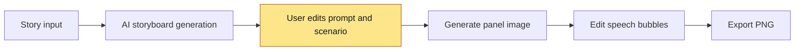
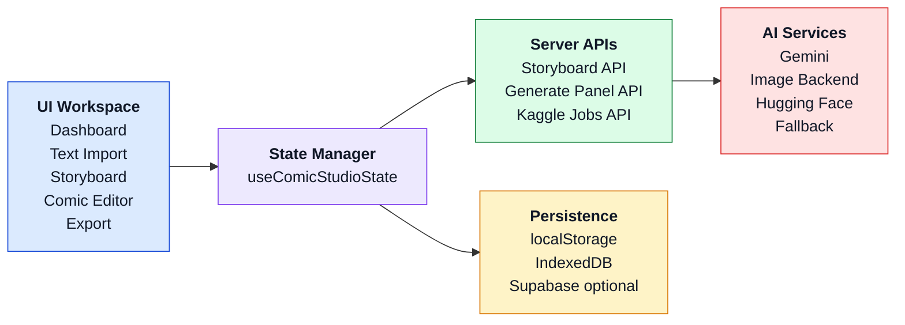
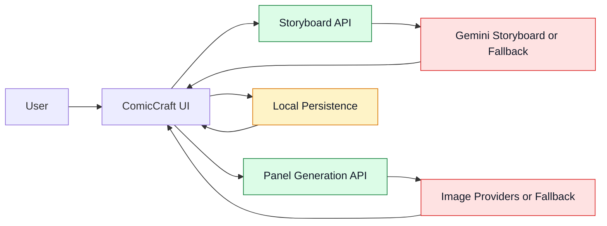
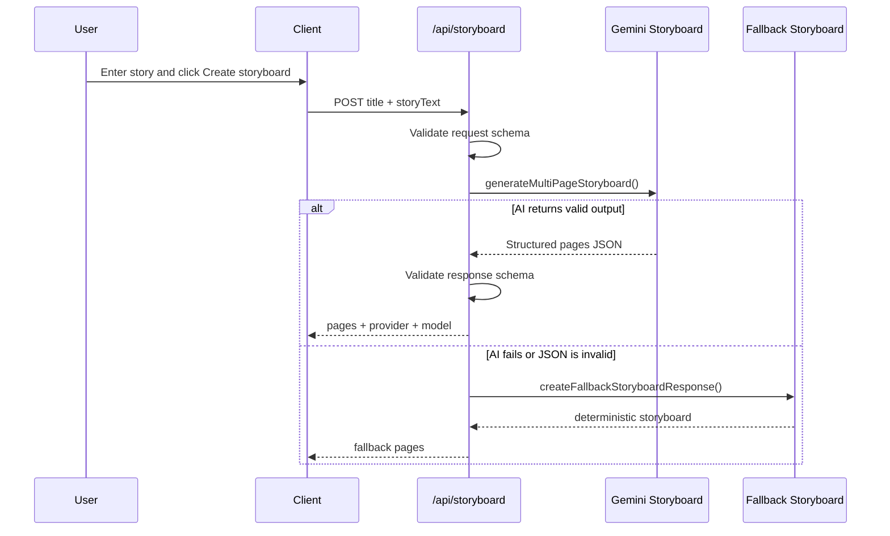
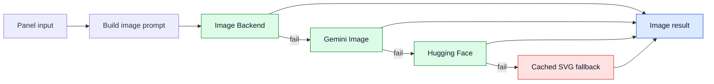
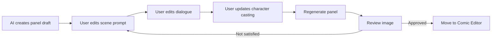
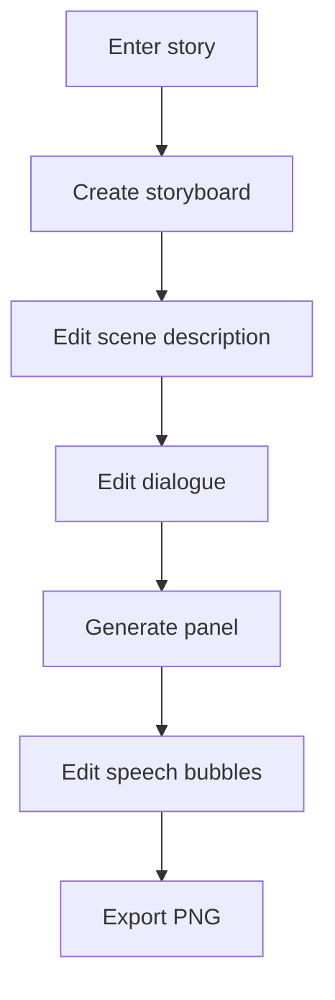
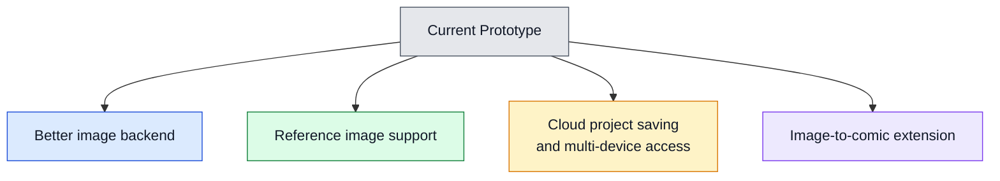

# Presentation v4: ComicCraft AI

## Ghi chú định vị

Tên trình bày dùng là **ComicCraft AI**, nhưng nội dung cần bám đúng capability hiện tại của repo:

```text
Text -> Storyboard -> Prompt chỉnh tay -> Generate panel image -> Bubble edit -> Export PNG
```

Phiên bản `v4` kế thừa toàn bộ cấu trúc của `v3`, bổ sung chi tiết báo cáo so sánh, đánh giá và lý do lựa chọn các mô hình AI sinh ảnh từ nghiên cứu thực nghiệm năm 2026.

## Slide 1. Trang tiêu đề

### Nội dung đặt trên slide

**ComicCraft AI**  
Ứng dụng tạo truyện tranh với AI và chỉnh sửa scenario thủ công theo prompt

ComicCraft AI là một ứng dụng web hỗ trợ chuyển đổi truyện chữ thành truyện tranh số thông qua quy trình cộng tác giữa AI và người dùng. Hệ thống được thiết kế để AI tạo bản nháp ban đầu, còn người dùng giữ quyền kiểm soát đối với scenario, prompt, lời thoại và kết quả hình ảnh ở từng khung truyện.

### Cách thể hiện

- Bố cục `hero slide`
- Bên trái: tiêu đề và đoạn mô tả ngắn
- Bên phải: screenshot lớn màn `Storyboard`
- Dưới cùng: tên nhóm, môn học, giảng viên, ngày báo cáo

## Slide 2. Động lực nghiên cứu

### Nội dung đặt trên slide

- Người dùng có ý tưởng truyện nhưng thiếu kỹ năng vẽ và thời gian dựng comic thủ công
- Công cụ AI hiện nay tạo nội dung nhanh nhưng khó kiểm soát mạch truyện, lời thoại và tính nhất quán nhân vật
- Nhu cầu thực tế là một quy trình tạo comic có thể sửa, thử lại và hoàn thiện

### Cách thể hiện

- Bố cục `3 cột vấn đề`
- Dòng chốt ở cuối slide:
  `Vấn đề không chỉ là tạo ảnh, mà là tạo comic có thể biên tập được`

## Slide 3. Phát biểu bài toán

### Nội dung đặt trên slide

- Chuyển truyện chữ thành truyện tranh số theo quy trình end-to-end
- Tận dụng AI để tạo storyboard và hình ảnh nhưng vẫn giữ quyền kiểm soát cho người dùng
- Duy trì khả năng hoạt động khi backend AI lỗi, timeout, quota hoặc offline

### Cách thể hiện

- Bố cục `problem statement`
- Tô nổi từ khóa `end-to-end`, `control`, `robustness`

## Slide 4. Mục tiêu nghiên cứu

### Nội dung đặt trên slide

- Xây dựng ứng dụng web hỗ trợ nhập truyện, tạo storyboard, sinh ảnh panel, chỉnh lời thoại và export
- Cho phép người dùng chỉnh scenario thủ công trước và sau bước sinh ảnh
- Bảo đảm hệ thống vẫn có thể hoàn tất demo khi dịch vụ AI không ổn định

### Cách thể hiện

- Bố cục `3 khối mục tiêu`
- Nhãn gợi ý: `Pipeline`, `User Control`, `Reliability`

## Slide 5. Câu hỏi nghiên cứu

### Nội dung đặt trên slide

1. AI có giúp rút ngắn thời gian tạo comic nháp không?
2. Chỉnh prompt thủ công có giúp kiểm soát kết quả tốt hơn không?
3. Fallback và validation có làm hệ thống ổn định hơn trong demo thực tế không?

### Cách thể hiện

- Bố cục `question slide`
- Dùng đánh số lớn `01 02 03`

## Slide 6. Phạm vi nghiên cứu

### Nội dung đặt trên slide

**Trong phạm vi**

- Text import
- Storyboard generation
- Panel image generation
- Character casting
- Speech bubble editor
- PNG export

**Ngoài phạm vi**

- Mạng xã hội truyện tranh
- Mobile app native
- Huấn luyện model riêng
- Chất lượng ảnh thương mại

### Cách thể hiện

- Bố cục `2 cột so sánh`

## Slide 7. Hướng tiếp cận tổng quát

### Nội dung đặt trên slide

- AI tạo bản nháp nhanh
- Người dùng giữ quyền kiểm soát nội dung
- Hệ thống ưu tiên chỉnh sửa hơn tự động hóa hoàn toàn

### Diagram



### Cách thể hiện

- Bố cục `flow slide`
- Đặt diagram ở trung tâm
- Nhấn màu ở bước `User chỉnh prompt và scenario`

## Slide 8. Tổng quan ứng dụng

### Nội dung đặt trên slide

- `Dashboard`: quản lý project
- `Text Import`: nhập truyện và chọn style
- `Storyboard Workspace`: chỉnh cảnh, lời thoại, nhân vật
- `Comic Editor`: chỉnh bubble trên ảnh
- `Export`: xuất PNG dọc

### Cách thể hiện

- Bố cục `screen gallery`
- Dùng 3 screenshot: `Import`, `Storyboard`, `Comic Editor`

## Slide 9. Các mô-đun cốt lõi của hệ thống

### Nội dung đặt trên slide

- Giao diện người dùng kết nối qua orchestrator trung tâm `useComicStudioState`
- Quản lý panel actions, navigation, persistence (localStorage, IndexedDB) và API calls
- Server APIs gọi các dịch vụ AI chuyên biệt (Gemini, Image Backend, Hugging Face)
- Hệ thống lưu trữ cục bộ bảo đảm dữ liệu hoạt động an toàn kể cả khi mất kết nối mạng

### Diagram



### Cách thể hiện

- Bố cục `horizontal architecture slide`
- Sơ đồ từ trái sang phải, các khối có màu nền khác nhau để dễ nhận diện

<h2>Slide 10. Luồng vận hành của hệ thống</h2>

### Nội dung đặt trên slide

- Người dùng thao tác trên giao diện để tạo storyboard, sinh ảnh và chỉnh comic
- UI gọi hai API trung tâm là storyboard API và panel generation API
- Kết quả từ AI services quay lại giao diện, đồng thời trạng thái được lưu local-first
- `useComicStudioState` là điểm điều phối chính giúp liên kết UI events, API calls và local persistence thành một workflow thống nhất

### Diagram



### Cách thể hiện

- Bố cục `horizontal runtime flow` với User và vòng lặp phản hồi của hệ thống.

## Slide 11. Luồng tạo storyboard

### Nội dung đặt trên slide

- Nhận `storyTitle` và `storyText`
- Validate request bằng schema
- Gọi Gemini storyboard nếu có key
- Parse và validate JSON trả về
- Dùng fallback storyboard nếu AI lỗi hoặc JSON không hợp lệ

### Diagram



### Cách thể hiện

- Bố cục `sequence diagram slide` nhấn mạnh tính tự phục hồi (resilience).

## Slide 12. Luồng sinh ảnh panel và cơ chế fallback

### Nội dung đặt trên slide

- Prompt ảnh được tạo từ `scene prompt`, `dialogue`, `character context`, `style`, `seed`
- Hệ thống thử provider theo thứ tự ưu tiên từ trái sang phải
- Nếu provider trước thất bại, hệ thống chuyển sang provider tiếp theo
- Fallback cuối cùng giúp app vẫn tiếp tục chạy khi backend ảnh không sẵn sàng

### Diagram



### Cách thể hiện

- Bố cục `horizontal fallback chain` thể hiện cơ chế suy giảm chất lượng có kiểm soát (graceful degradation).

## Slide 13. So sánh các mô hình sinh ảnh nền tảng (Base Image Generation)

### Nội dung đặt trên slide

| Mô hình | Loại Kiến trúc | Ưu điểm nổi bật | Nhược điểm & Trạng thái API | Kết luận lựa chọn |
| :--- | :--- | :--- | :--- | :--- |
| **FLUX.1-schnell** | 12B DiT | - Sinh ảnh siêu tốc (1-4 steps)<br/>- Khả năng render chữ xuất sắc<br/>- License mở (Apache 2.0) | - Chi tiết ảnh có phần mờ hơn bản Dev<br/>- **Hoạt động rất tốt trên HF Serverless** | **Chọn làm mặc định** vì cân bằng tốt nhất giữa tốc độ, chất lượng và khả năng triển khai serverless thực tế |
| **FLUX.1-dev** | 12B DiT | - Chất lượng chi tiết ảnh tối đa<br/>- Bám prompt cực tốt, hệ LoRA mạnh | - Nặng (~23GB), sinh ảnh chậm<br/>- **Bị HF Serverless ngưng hỗ trợ (Lỗi 410)** | Không chọn vì chất lượng cao nhưng không còn phù hợp môi trường triển khai của đề tài |
| **Stable Diffusion 3.5 Large** | 8.1B MMDiT | - Bám prompt tốt, chi tiết nghệ thuật cao<br/>- Hỗ trợ tốt cho vẽ minh họa/comic | - Thời gian xử lý chậm (~15s)<br/>- Dễ gây timeout serverless function | Không chọn làm mặc định vì độ trễ cao, khó bảo đảm trải nghiệm thao tác lặp nhiều lần |
| **Google Imagen 4.0** | Latent Diffusion | - Chất lượng photorealism đỉnh cao<br/>- Ánh sáng & bố cục cực kỳ chuyên nghiệp | - API đóng, tính phí trên Vertex AI<br/>- Không thể chạy local / fine-tune | Không chọn vì mạnh về chất lượng nhưng kém phù hợp về chi phí, tính mở và khả năng tùy biến |
| **SDXL Base 1.0** | Latent U-Net | - Kho tài nguyên LoRA phong phú (Civitai)<br/>- Tốc độ nhanh, nhẹ hơn dòng DiT | - Bám prompt và render chữ kém hơn DiT<br/>- **Bị HF Serverless ngưng hỗ trợ (Lỗi 410)** | Không chọn vì vừa yếu hơn DiT ở chất lượng prompt, vừa không còn ổn định trên serverless |

### Cách thể hiện

- Bố cục `comparison table`
- Tô xanh hàng `FLUX.1-schnell` để thể hiện đây là lựa chọn cuối cùng
- Tô đỏ/lưu ý các mô hình bị khai tử hoặc lỗi thời trên môi trường serverless (FLUX-dev/SDXL)
- Dòng kết slide: `Chúng tôi chọn FLUX.1-schnell vì đây là phương án thực dụng nhất cho demo web serverless`

## Slide 13.1. So sánh các giải pháp nhất quán nhân vật (Character Consistency)

### Nội dung đặt trên slide

| Phương pháp | Cơ chế hoạt động | Ưu điểm (Pros) | Nhược điểm (Cons) | Kết luận lựa chọn |
| :--- | :--- | :--- | :--- | :--- |
| **StoryDiffusion** | Consistent Self-Attention (NeurIPS 2024) | - Zero-shot (Không cần training)<br/>- Đồng bộ bối cảnh, tóc tai, quần áo | - Cần VRAM cực lớn để chạy batch<br/>- Phù hợp với Dedicated GPU Server | Không chọn cho bản hiện tại vì vượt quá tài nguyên vận hành của app web demo |
| **PuLID** | Dual-Branch Contrastive Alignment | - Bảo toàn khuôn mặt cực kỳ tốt<br/>- Giữ nguyên phong cách của prompt gốc | - Chỉ giữ khuôn mặt, trang phục & dáng người vẫn biến đổi | Không chọn làm giải pháp chính vì chỉ giải quyết một phần của bài toán consistency |
| **Visual Context Prompting** | Regional / Prompt Injection | - Không tốn tài nguyên tính toán<br/>- Tận dụng sức mạnh bám prompt của DiT | - Dựa vào khả năng mô tả chi tiết của văn bản, độ đồng bộ khuôn mặt tương đối | **Chọn cho hệ thống hiện tại** vì nhẹ nhất, dễ tích hợp nhất và phù hợp kiến trúc serverless |
| **IP-Adapter FaceID** | Feature Injection | - Rất nhẹ, chạy nhanh, dễ tích hợp | - Độ tương đồng khuôn mặt trung bình<br/>- Mất quần áo & dáng người qua các cảnh | Không chọn vì cải thiện hạn chế, chưa đủ thuyết phục so với việc tăng chất lượng prompt |
| **PhotoMaker V2** | Stacked ID Embedding | - Khuôn mặt tự nhiên, không bị đơ | - Đòi hỏi user upload 3-4 ảnh chân dung, cản trở trải nghiệm người dùng | Không chọn vì làm tăng ma sát đầu vào cho người dùng, trái mục tiêu thao tác nhanh |

### Cách thể hiện

- Bố cục bảng phân loại giải pháp
- Tô xanh hàng `Visual Context Prompting` để nhấn mạnh lựa chọn thực tế
- Chốt hạ: `Visual Context Prompting` tối ưu cho Serverless; `StoryDiffusion + PuLID` phù hợp hơn nếu có Dedicated GPU Server

## Slide 13.2. So sánh các mô hình ngôn ngữ kịch bản (LLM Storyboard Generators)

### Nội dung đặt trên slide

| Mô hình | Đặc điểm chính | Điểm mạnh với đề tài | Hạn chế | Kết luận lựa chọn |
| :--- | :--- | :--- | :--- | :--- |
| **Gemini 3.5 Flash / 3.1 Flash-Lite** | Hỗ trợ Structured JSON Output, gọi qua Google API | Hiểu tiếng Việt tốt, schema ổn định, chi phí thấp, phù hợp workflow storyboard nhiều bước | Phụ thuộc API bên ngoài và quota | **Chọn làm mặc định** vì độ ổn định đầu ra JSON quan trọng hơn lợi thế open-weight trong bối cảnh demo |
| **Qwen 2.5 Instruct** | Dải model rộng, hỗ trợ context window lớn, open weight | Hiểu ngữ cảnh tốt, có tiềm năng self-host và tùy biến | Bản mạnh cần tài nguyên lớn, chi phí host local cao hơn | Không chọn hiện tại vì tốt về nghiên cứu nhưng chưa tối ưu cho môi trường triển khai gọn nhẹ |
| **Llama 3.2 Instruct** | Model nhỏ, dễ chạy local hoặc on-device | Gọn nhẹ, dễ thử nghiệm nhanh | Tiếng Việt và độ ổn định JSON kém hơn, dễ lỗi format khi schema phức tạp | Không chọn vì storyboard của đề tài cần đầu ra có cấu trúc ổn định hơn là chỉ chạy nhẹ |

### Cách thể hiện

- Bố cục bảng so sánh gọn để người nghe nhìn ra ngay tiêu chí chọn
- Tô xanh hàng `Gemini` và thêm icon cho `JSON stability` và `Vietnamese understanding`
- Dòng kết slide: `Chúng tôi ưu tiên mô hình ít lỗi JSON nhất vì storyboard là đầu vào của toàn bộ pipeline sau đó`

## Slide 13.3. Tiêu chí lựa chọn & Quyết định kỹ thuật (Selection Rationale)

### Nội dung đặt trên slide

- **Lựa chọn mô hình sinh ảnh**: Chọn **FLUX.1-schnell** làm mặc định (sinh ảnh siêu tốc ~1.2s, bám prompt xuất sắc, chạy ổn định trên Serverless API của HF).
- **Lựa chọn mô hình ngôn ngữ**: Chọn **Gemini 3.5 Flash** nhờ khả năng khóa JSON Structured Output tuyệt đối, tránh lỗi phân tích cú pháp.
- **Giải pháp nhất quán nhân vật**: Sử dụng **Visual Context Prompting** (tiêm mô tả nhân vật từ Character Casting vào prompt) để hệ thống vận hành siêu nhẹ, không tốn tài nguyên chạy adapter phức tạp.
- **Giải quyết lỗi giới hạn tài nguyên (HTTP 402)**: Áp dụng cơ chế **BYOK (Bring Your Own Key)** trên giao diện cho phép người dùng tự cấu hình API Key cá nhân lưu ở local.

### Cách thể hiện

- Bố cục 4 thẻ quyết định với icon tick xanh thể hiện tính thực tiễn và tính kinh tế của kiến trúc.

## Slide 14. Cơ chế chỉnh sửa scenario thủ công

### Nội dung đặt trên slide

- Chỉnh `scene prompt` cho từng panel
- Chỉnh `dialogue` trước hoặc sau khi có ảnh
- Bổ sung mô tả nhân vật qua `Character Casting`
- Regenerate riêng từng panel theo prompt mới

### Diagram



### Cách thể hiện

- Bố cục `before/after + loop` thể hiện quy trình cộng tác (Human-in-the-loop).

## Slide 15. Các chức năng chính đã hoàn thành

### Nội dung đặt trên slide

- Tạo project từ truyện chữ
- Tạo storyboard nhiều panel
- Chỉnh prompt và dialogue
- Character casting
- Generate / Regenerate panel
- Bubble editor kéo thả
- Export PNG dọc
- Local persistence và error recovery

### Cách thể hiện

- Bố cục `checklist slide` chia 2 cột với icon check.

## Slide 16. Đánh giá hệ thống

### Nội dung đặt trên slide

**Tiêu chí đánh giá**

- Hoàn thành flow từ truyện chữ đến comic
- Có thể chỉnh sửa scenario ở cấp panel
- Hệ thống vẫn chạy khi AI lỗi
- Kết quả đầu ra có thể export và sử dụng

**Bằng chứng kỹ thuật**

- Unit tests
- Integration tests
- Playwright E2E
- Typed API contracts
- Build/lint/test gates

### Cách thể hiện

- Bố cục `2 khối`: Trái (tiêu chí), Phải (bằng chứng kỹ thuật).

## Slide 17. Kịch bản demo

### Nội dung đặt trên slide

1. Nhập truyện
2. Tạo storyboard
3. Sửa mô tả cảnh
4. Sửa lời thoại
5. Vẽ panel
6. Chỉnh bubble
7. Export PNG

### Diagram



### Cách thể hiện

- Bố cục `demo roadmap` highlight bước `Sửa mô tả cảnh`.

## Slide 18. Hạn chế hiện tại

### Nội dung đặt trên slide

- Chất lượng ảnh còn phụ thuộc backend AI
- Character consistency mới ở mức prompt/reference
- Upload ảnh đầu vào chưa là flow cốt lõi trong UI
- Supabase chưa là persistence mặc định

### Cách thể hiện

- Bố cục `4 thẻ rủi ro`, mỗi thẻ gồm hạn chế và ý nghĩa thực tế.

## Slide 19. Hướng phát triển

### Nội dung đặt trên slide

- Upload reference image thật cho character/scene
- Tích hợp backend sinh ảnh mạnh hơn
- Lưu project online và chia sẻ giữa nhiều thiết bị
- Mở rộng sang pipeline image-to-comic

### Diagram



### Cách thể hiện

- Bố cục `roadmap branches` với một nút trung tâm và 4 nhánh phát triển song song
- Mỗi hướng phát triển dùng một màu riêng để người xem phân biệt nhanh

## Slide 20. Kết luận

### Nội dung đặt trên slide

- ComicCraft AI chứng minh tính khả thi của workflow tạo truyện tranh có AI hỗ trợ
- Đóng góp chính là kết hợp AI sinh nháp với chỉnh sửa scenario thủ công
- Human-in-the-loop phù hợp hơn full automation trong bài toán sáng tạo

### Cách thể hiện

- Bố cục `closing slide` với thông điệp:
  `AI hỗ trợ sáng tác hiệu quả hơn khi người dùng vẫn giữ quyền kiểm soát nội dung`
